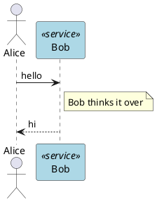

# Getting started

plantuml-ts is a TypeScript port of [PlantUML](https://plantuml.com). It
parses PlantUML source and renders directly to SVG — no Java, no PlantUML
server, no DOM — so it runs the same way in the browser and in Node.js.

## Install & build

The library is not yet published to npm. For now, clone and build:

```bash
git clone https://github.com/knowvah/plantuml-ts.git
cd plantuml-ts
npm install
npm run build         # → dist/plantuml-ts.js (ESM) + dist/plantuml-ts.cjs
```

`npm run build` runs the Vite library build, producing an ESM bundle
(`dist/plantuml-ts.js`), a CJS bundle (`dist/plantuml-ts.cjs`), and type
declarations (`dist/plantuml-ts.d.ts`), wired through `package.json`'s
`exports` map.

## Render a diagram

Start with ordinary PlantUML source. This one is a sequence diagram with a
participant declaration, a note, and a preprocessor variable:



Pass it to `renderSync` and you get the SVG back as a string:

```ts
import { renderSync } from '@knowvah/plantuml-ts';

const source = `
@startuml
actor Alice
participant Bob <<service>> #lightblue

Alice -> Bob: hello
note right of Bob: Bob thinks it over
Bob --> Alice: hi
@enduml
`;

const svg = renderSync(source);
console.log(svg); // <svg ...>...</svg>
```

To see it drawn, paste the source into the [playground](/playground).

`renderSync(source, options?)` parses the PlantUML source, resolves the
theme/skinparam/style-block chain, lays out the diagram, and returns the SVG
string synchronously. On a parse or layout error it returns a small SVG
containing the error message rather than throwing.

::: tip !include is not supported by renderSync
`renderSync` cannot fetch. If `source` contains an `!include` directive and
no `options.includeStore` is supplied, it returns an error SVG rather than
resolving it. Use the async `render(source, options?)` instead — it
resolves includes first via `prepareIncludeStore()` — or prefetch them
yourself with `prepareIncludeStore()` and pass the result as
`options.includeStore` to `renderSync`. See [API reference](/guide/api) for
both signatures and the include-resolver seam.
:::

## Browser usage

`renderSync` and `render` have no DOM or Node built-in dependencies — import
the package directly in a bundled web app and call it from an event handler
or effect. The default text measurer (`CanvasMeasurer`) uses the DOM
`<canvas>` API when available, falling back to a formula-based measurer
(`FormulaMeasurer`) when it is not (e.g. during SSR).

## Node.js usage

`renderSync`/`render` work unchanged under Node — the library never touches
`fs`, `path`, `process.env`, or other Node built-ins. In Node,
`CanvasMeasurer` construction fails (no `<canvas>`), so the library falls
back to `FormulaMeasurer` automatically; pass a custom `measurer` in
`options` for more precise metrics (see [API reference](/guide/api)).

## Next steps

- [API reference](/guide/api) — the full public surface: `renderSync`,
  `renderPagesSync`, `render`, `renderPages`, `renderAll`, the measurer
  seam, the include-resolver seam, the stdlib seam, and the asset seam.
- [Playground](/playground) — edit PlantUML source and see SVG live, in your
  browser.
- [Known divergences](/divergences) — where plantuml-ts intentionally
  differs from upstream PlantUML, including preprocessor scope.
