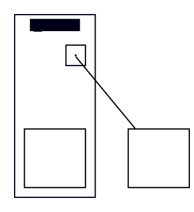

# Cluster-scoped {rank=source|sink} subgraph: bbox effect unresolved (contradictory repros)

**Status: INVESTIGATION REQUESTED — not a verified finding.** Two
independent probe sessions ran what should be the same minimal repro
against dot-engine's programmatic builder and got contradictory
results (details below). Filed by maintainer direction (2026-07-22) so
dot-engine can investigate, despite failing this tracker's normal
"verified" bar; do not treat either claimed behavior as established.

**Impact:** blocks the entire PlantUML entrypoint/exitpoint border-point
family (~20 state fixtures, incl. `pesita-10-dene726`,
`bitaxo-18-tamo974`, `kotagu-43-miza629`) from real cluster geometry.
Jar's DOT for these clusters puts each border-point node in an
anonymous `{rank=source;...}` / `{rank=sink;...}` subgraph that is a
direct child of the cluster (sibling of the `${id}ee` inner subgraph),
forcing the port node to the cluster's topmost/bottommost rank. Until
dot-engine's behavior for this shape is pinned down, plantuml-ts
cannot thread its (already-computed) `DotInputCluster.portRanks` into
the real-layout builder, and the family's clusters collapse (e.g.
pesita's `AA` renders 36×36 vs jar's 126×104.72).

## The question for dot-engine

For a rank subgraph nested INSIDE a cluster (built programmatically:
`clusterHandle.addSubgraph(name, {rank: 'source'})` + `.addNode(id)`,
with the same id also added to the cluster itself), what exactly
happens to (a) the ranked node's position and (b) the cluster's
reported bbox in `getLayout().clusters` — and does it match real
`dot` on the equivalent DOT text?

What the two sessions AGREED on (root-level placement — likely
correct already, listed for contrast): building the rank subgraph on
the ROOT builder while the node is also a cluster member prints
`Warning: <id> was already in a rankset, deleted from cluster <name>`
(`markClusterNode`, the `dotgen/rank.c` cluster/rankset conflict rule)
and the cluster bbox excludes the node.

Where they CONTRADICT (cluster-nested placement, the jar-shaped case):

- Session A (G6 T8-R2): no warning; node's rank honored; cluster bbox
  grew to include the rank-forced position (repro height
  68.72 → 108.72).
- Session B (G6 T9-retry): same described builder calls — node Y
  **unchanged** (no rank-based repositioning observed), cluster width
  grew by the rank subgraph's own CL_OFFSET margin only. Adding or
  removing unrelated top-level sibling nodes did not change this.

At least one repro is wrong, or an unnoticed variable (builder call
order, subgraph naming, node-added-to-cluster-before-vs-after-subgraph,
version) separates them. Real `dot` on jar's literal cached DOT
produces the jar-matching narrow/tall layout, so the DOT semantics
themselves are known-good ground truth.

## Repro DOT (jar-shaped, minimal)

Distilled from `test-results/dot-cache/state/pesita-10-dene726/svek-3.dot`
(cluster15/AA region) — one border-point rect on `rank=sink`, one point
anchor inside the `ee` inner subgraph:



## Procedure

1. Ground truth: run the repro through real `dot -Tsvg` (15.x) and
   through dot-engine's DOT-text parser (`renderSvg(dotSource)`).
   Record `cluster15`'s bbox and `sh0019`'s y. (G6 T8-R1 found the
   text-parser path byte-matches real dot on jar's full cached DOT —
   expected to agree here.)
2. Builder path: reconstruct the same graph via the programmatic API —
   root graph attrs as above; `const c = builder.addSubgraph('cluster15',
   {style, color, labeljust})` + HTML label via `setHtmlAttr`;
   `c.addSubgraph('sink_group_15', {rank:'sink'}).addNode('sh0019')`
   (the rank-subgraph name must NOT start with `cluster` — see
   Resolution; this document originally said `cluster15rank_sink`
   here, which IS the bug);
   `c.addNode('sh0019')` (shape/width/height as above);
   `c.addSubgraph('cluster15ee', {label:''}).addNode('zaent0002')`
   (point); root-level `sh0020` + edge. Compare `getLayout()`'s
   cluster bbox and node positions against step 1.
3. Toggle the variables the two sessions may have differed on: order
   of `addNode` vs `addSubgraph` calls, rank-subgraph name, node
   declared on the cluster handle vs only inside the rank subgraph.
   Identify which variant reproduces which session's result.
4. If the builder path cannot be made to match step 1's ground truth
   under any call order, that is the library defect: cluster-scoped
   rank subgraphs mis-integrate with cluster bbox computation
   (`csRanksetKind`/`csProcessRankset` → cluster bbox path).

Success criterion for closing: the builder-constructed graph's
`getLayout()` cluster bbox matches real dot on the repro (sh0019
forced to the cluster's bottom rank, bbox includes it), and
plantuml-ts's border-point fixtures re-measure to T8's FrontierCalculator
predictions (pesita `AA` 126×104.72, kotagu `CompositeState` 289×358,
bitaxo `C` 42×~101.4).

## Evidence trail

- `plans/g6-cluster-geometry/batch-4/withlabel-derivation.md` — Round 2
  `rankSpec` section (Session A's repro claim + `csRanksetKind`/
  `markClusterNode` code references) and Round 1 §3b/§4
  (FrontierCalculator predictions).
- `plans/g6-cluster-geometry/decision-journal.md` — 2026-07-22 rows:
  T9-retry permanent stop, measured misses with both mechanisms wired
  (pesita 83×124.36 vs 126×104.72; kotagu 237×365 vs 289×358; bitaxo
  75×33.36 vs 42×101.36), and Session B's contradicting repro note.
- Unwired-but-tested FrontierCalculator port ready to consume a fixed
  layout: `src/diagrams/state/state-composite-frontier.ts` (commit
  60fe88a).

---

**RESOLVED — usage defect, no dot-engine change (investigated
2026-07-22, dot-engine side closed).** The contradiction adjudicated:
`isACluster(g)` (`dot-engine/src/layout/dot/rank.ts:87-91`,
C-faithful port of `lib/common/utils.c:is_a_cluster`) treats ANY
subgraph whose name starts with `cluster` (case-insensitive) as a
real rendered cluster. G6 T8-R2's suggested rank-subgraph naming
(`${outerName}rank_sink` → e.g. `cluster15rank_sink`) tripped this:
`csSetupCluster` routed the rank group through
`makeNewCluster`/`nodeInduce` (nested-cluster machinery — own bbox,
margins, no rank forcing) instead of `csProcessRankset`
(`rank-dot2.ts:163-170`, the actual rank=sink implementation).
Session B (T9) followed that naming and saw exactly this failure;
Session A evidently used a non-cluster-prefixed name. Call order and
membership-call variants ruled out (identical results). Jar's real
DOT uses ANONYMOUS rank subgraphs (auto-named `%N` — can never start
with `cluster`), so real dot and dot-engine's DOT-text path were
never affected.

Verified: minimal repro builder path with a non-`cluster`-prefixed
name matches real dot 15.1.0 exactly (cluster15 66×149.72, sh0019
forced to sink rank); pesita's full svek-3.dot text-path cluster15
matches real dot within float tolerance (148×118.72). The pinned
.tgz needs no change.

Correct builder sequence for plantuml-ts's future border-point wiring
(order-independent):

```ts
const c = builder.addSubgraph('cluster15', { style, color, labeljust });
c.setHtmlAttr('label', htmlLabel);
c.addSubgraph('sink_group_15', { rank: 'sink' }).addNode('sh0019');   // name must not start with "cluster"
c.addNode('sh0019', { shape: 'rect', width: '0.693576', height: '0.666667', label: '' });
c.addSubgraph('cluster15ee', { label: '' }).addNode('zaent0002', /* point */);
```

Tracker box checked on this basis: nothing pending in dot-engine.
NOTE: the affected plantuml-ts fixtures have NOT yet re-measured
clean — the border-point wiring itself remains unimplemented (G6
batch-4 stopped; see plans/g6-cluster-geometry/README.md). The
re-attempt is unblocked by this resolution but is a separate,
maintainer-authorized effort.

---

**VERIFIED (dot-engine maintainer, 2026-07-22).** Re-ran the minimal
repro three ways against real dot 15.1.0 as ground truth. This upgrades
the finding from "investigation requested" to confirmed; the numbers
settle the Session A / Session B contradiction definitively:

| path | cluster15 (w×h) | sh0019 | vs real dot |
|---|---|---|---|
| real `dot -Txdot` (ground truth) | 66 × 149.72 | sink (bottom, y≈40) | — |
| dot-engine DOT-text (`renderSvg`/`getLayout`) | 66.00 × 149.72 | y=40 (sink) | exact |
| builder, rank-subgraph name `cluster15rank_sink` | **117 × 97** | y=132 (NOT sink) | broken |
| builder, rank-subgraph name `sink_group_15` | 66.00 × 149.72 | y=40 (sink) | exact |

The `cluster`-prefixed name is the whole defect: `isACluster`
(`src/layout/dot/rank.ts:87-91`) treats it as a real cluster (C-faithful
— real dot's `is_a_cluster` has the identical name-prefix rule), so the
rank set is routed through `makeNewCluster`/`nodeInduce` instead of
`csProcessRankset`, giving a wrong bbox (117×97) and no rank forcing
(sh0019 at y=132, not the sink). A non-`cluster` name reproduces real dot
to the digit. Call order and node-membership variants were irrelevant.
**dot-engine confirmed closed — no library change.** Session A used a
clean name; Session B used the `cluster`-prefixed one.
