# A flat (same-rank) edge's label width does not affect node separation

**Impact:** every diagram with a labelled `minlen=0` edge. Concretely
`object/zebufu-01-pevo013`, `object/style-stereotype-on-arrow-3` and
`object/style-stereotype-on-arrow-7` — each 30-34 diffs that are
otherwise entirely downstream of one wrong node position. Filed as
plantuml-ts ledger **B34/M39**.

**Finding.** For an edge with `minlen=0` (both endpoints on the same
rank, which is how PlantUML expresses a horizontal association),
dot-engine places the two nodes a **constant** distance apart
regardless of the edge label's width. Real graphviz grows the gap with
the label, because the label occupies horizontal space between the two
nodes on that rank.

Measured with the same graph fed to `layoutGraph()` four times, varying
only `labelWidth`:

| `labelWidth` | dot-engine box-to-box gap |
|---|---|
| 0 | 60.425 |
| 29 | 60.425 |
| 200 | 60.425 |
| 400 | 60.425 |

The jar (real graphviz, `-DPLANTUML_DETERMINISTIC_TEXT=true`) on the
equivalent sources:

| edge label | jar gap |
|---|---|
| `ab` | 50.425 |
| `label` (29 wide) | **63.425** |
| `aVeryMuchLongerEdgeLabelHere` | 232.425 |

i.e. jar gap ≈ `labelWidth + 34.4`; dot-engine is flat at 60.425.

**What is NOT the cause (falsified — don't chase):**

- **Stroke width.** The first attribution was "ink extent ignores stroke
  width", on the coincidence that the shortfall equalled a fixture's
  `linethickness: 3`. The jar renders that fixture byte-identically with
  and without the declaration; so do we. `LimitFinder` has no stroke term
  in any handler (`klimt/drawing/LimitFinder.java:159-225`).
- **Our label-width rounding.** We hand the engine `labelWidth`
  `29.54375` where the DOT text says `WIDTH="29"` (upstream truncates,
  `svek/SvekEdge.java:505-506`; we `Math.round` at
  `src/core/svek-dot-emit.ts:44`). That discrepancy is real and worth
  fixing on its own merits, but it is **not** this: the table above shows
  the engine ignores the value entirely, so 29 vs 29.54 changes nothing.
- **Our DOT emission.** The svek DOT we emit for `zebufu-01` is
  **byte-identical** to the oracle's; every structural check passes and
  `maxSizeDeltaIn` is 0.

## Repro

```dot
digraph unix {
nodesep=0.486111;
ranksep=0.833333;
remincross=true;
searchsize=500;
sh0006 [shape=rect,label="",width=0.410764,height=0.472222];
sh0007 [shape=rect,label="",width=0.410764,height=0.472222];
sh0006->sh0007[arrowtail=none,arrowhead=none,minlen=0,
  label=<<TABLE FIXEDSIZE="TRUE" WIDTH="29" HEIGHT="15"><TR><TD></TD></TR></TABLE>>];
}
```



Expected (real `dot`): the two nodes' box-to-box gap grows with the
label's width — 63.425 for `WIDTH="29"`.

Actual (dot-engine): 60.425, unchanged for any `WIDTH`.

## Secondary symptom, same repro

The nodes also sit 0.389px higher than the jar places them (`y=7` vs
`y=7.389`). Recorded here because it reproduces on the identical input
and may share a cause with the rank's own height allocation; it has not
been isolated separately.


## Verification attempt on dot-engine 1.4.0 (2026-08-13) — inconclusive

Not verified. The three fixtures this issue names — `object/zebufu-01-pevo013`,
`object/style-stereotype-on-arrow-3`, `object/style-stereotype-on-arrow-7`,
each cited at 30-34 diffs — sit in the object SVG census's `31+ diffs` bucket.
That census is **byte-identical between 1.3.0 and 1.4.0**, distribution
included: `0 diffs 35 / 1-3 1 / 4-10 7 / 11-30 15 / 31+ 22`. All five DOT gates
are likewise unmoved.

So either the fix does not reach these fixtures, or it does and something
downstream still dominates their diff count. Distinguishing those needs a
per-fixture diff count before and after, not the bucket histogram — the census
only names fixtures in its zero-diff list.

### Resolved: the instrument now exists, and this is its baseline

`scripts/svg-conformance-census.ts --per-fixture` prints one name-sorted line
per fixture with its diff count, which is what the bucket histogram could not
show. Baseline on **dot-engine 1.4.0**, `DeterministicMeasurer`:

| fixture | diffs |
|---|---|
| `object/style-stereotype-on-arrow-3` | 34 |
| `object/style-stereotype-on-arrow-7` | 30 |
| `object/zebufu-01-pevo013` | 34 |

These reproduce this issue's own "each 30-34 diffs" claim exactly, so the
instrument agrees with the original filing rather than re-deriving a different
number.

To verify a future engine bump, re-run and compare:

```bash
npx tsx scripts/svg-conformance-census.ts object --per-fixture > after.txt
diff before.txt after.txt
```

Rows are name-sorted precisely so this diff is readable — any count that moves
shows up as a one-line change. **Unchanged counts now mean "the fix does not
reach these fixtures", which the bucket histogram could never establish.**

---

## RECLASSIFIED 2026-08-13 — this is ours, not dot-engine's

**dot-engine honors the label width. This issue measured it through a path
that never sends one.**

Found while diagnosing the vertical analogue on
`class-inheritance-interface-assoc` (a rank gap that was 1.5pt too tall).
`src/core/graph-layout-build-edges.ts:85-89` sends class/component/usecase
edges a plain-text `label` attribute; only the state-composite pipeline sends
the jar's `<TABLE FIXEDSIZE="TRUE" WIDTH=".." HEIGHT="..">` reservation. On
the text path the engine measures the *text*, so `labelWidth` is inert — which
is exactly the "flat regardless of `labelWidth`" symptom above.

Re-measured, `minLen: 0`, box-to-box gap:

| label width | plain text (this issue's path) | FIXEDSIZE table | jar (from the table above) |
|---|---|---|---|
| 0 | 42.000 | 47.000 | — |
| 29 | 42.000 | **64.000** | 63.425 |
| 200 | 42.000 | **235.000** | ~234.4 |
| 400 | 42.000 | **435.000** | ~434.4 |

Flat on the text path; tracks the jar within ~0.6 on the table path.

The vertical case confirms it independently: given the table, dot-engine
reproduces real graphviz's rank gap *exactly* at every height tested
(boxH 15/20/30/60 → 75/80/90/120, identical to `dot`).

**What this issue got right and where it went wrong.** The DOT repro at the
top is sound — real `dot` does grow the gap with `WIDTH`. The error is the
inference that `layoutGraph()` was feeding the engine that same graph. It was
not: the `WIDTH` in the repro never reaches the engine through the call the
measurements used. The three "what is NOT the cause" entries all remain
correctly ruled out; the cause is a fourth thing none of them covered.

**Disposition:** not a dot-engine defect — no upstream fix to wait for. The
work is on our side and is scoped in
`.agent-notes/class-edge-label-rank-gap.md`, including why the one-line
fallback is not the fix (it regresses `usecase/jecici-56-bimu826`; the jar
reserves a *margined* box, `WIDTH="45"` where our raw `labelWidth` is
`42.3875`).
