# A flat (same-rank) edge's label width does not affect node separation

**Impact:** every diagram with a labelled `minlen=0` edge. Concretely
`object/zebufu-01-pevo013`, `object/style-stereotype-on-arrow-3` and
`object/style-stereotype-on-arrow-7` — each 30-34 diffs that are
otherwise entirely downstream of one wrong node position. Filed as
plantuml-ts ledger **B34/M39**.

**Finding.** For an edge with `minlen=0` (both endpoints on the same
rank, which is how PlantUML expresses a horizontal association),
graphviz-ts places the two nodes a **constant** distance apart
regardless of the edge label's width. Real graphviz grows the gap with
the label, because the label occupies horizontal space between the two
nodes on that rank.

Measured with the same graph fed to `layoutGraph()` four times, varying
only `labelWidth`:

| `labelWidth` | graphviz-ts box-to-box gap |
|---|---|
| 0 | 60.425 |
| 29 | 60.425 |
| 200 | 60.425 |
| 400 | 60.425 |

The jar (real graphviz, `-DPLANTUML_DETERMINISTIC_TEXT=true`) on the
equivalent sources:

| edge label | jar gap |
|---|---|
| `ab` | 50.425 |
| `label` (29 wide) | **63.425** |
| `aVeryMuchLongerEdgeLabelHere` | 232.425 |

i.e. jar gap ≈ `labelWidth + 34.4`; graphviz-ts is flat at 60.425.

**What is NOT the cause (falsified — don't chase):**

- **Stroke width.** The first attribution was "ink extent ignores stroke
  width", on the coincidence that the shortfall equalled a fixture's
  `linethickness: 3`. The jar renders that fixture byte-identically with
  and without the declaration; so do we. `LimitFinder` has no stroke term
  in any handler (`klimt/drawing/LimitFinder.java:159-225`).
- **Our label-width rounding.** We hand the engine `labelWidth`
  `29.54375` where the DOT text says `WIDTH="29"` (upstream truncates,
  `svek/SvekEdge.java:505-506`; we `Math.round` at
  `src/core/svek-dot-emit.ts:44`). That discrepancy is real and worth
  fixing on its own merits, but it is **not** this: the table above shows
  the engine ignores the value entirely, so 29 vs 29.54 changes nothing.
- **Our DOT emission.** The svek DOT we emit for `zebufu-01` is
  **byte-identical** to the oracle's; every structural check passes and
  `maxSizeDeltaIn` is 0.

## Repro

```dot
digraph unix {
nodesep=0.486111;
ranksep=0.833333;
remincross=true;
searchsize=500;
sh0006 [shape=rect,label="",width=0.410764,height=0.472222];
sh0007 [shape=rect,label="",width=0.410764,height=0.472222];
sh0006->sh0007[arrowtail=none,arrowhead=none,minlen=0,
  label=<<TABLE FIXEDSIZE="TRUE" WIDTH="29" HEIGHT="15"><TR><TD></TD></TR></TABLE>>];
}
```

Expected (real `dot`): the two nodes' box-to-box gap grows with the
label's width — 63.425 for `WIDTH="29"`.

Actual (graphviz-ts): 60.425, unchanged for any `WIDTH`.

## Secondary symptom, same repro

The nodes also sit 0.389px higher than the jar places them (`y=7` vs
`y=7.389`). Recorded here because it reproduces on the identical input
and may share a cause with the rank's own height allocation; it has not
been isolated separately.
