# `taillabel`/`headlabel` centres differ from graphviz — head label sits far too close to its node

**Impact:** every edge carrying a UML multiplicity (`A "1" -- "*" B`).
Concretely `object/tobuka-93-jale775` — 41 diffs, ALL of them edge-label
text positions plus one spline, on a fixture whose boxes and canvas are
otherwise exact. Filed as plantuml-ts ledger **B32/M41**.

**Finding.** For an edge with `taillabel` and `headlabel`, graphviz-ts's
`getLayout()` returns label centres that do not match real graphviz. The
head label is the severe case: graphviz clears it ~14.4px from the head
node's edge; graphviz-ts places it ~3px away.

Minimal repro — `@startuml object A / object B / A "1" -- "*" B @enduml`,
whose emitted svek DOT is **byte-identical** to the jar's (all structural
checks pass, `maxSizeDeltaIn` 0). Nodes come back `A(0,0)`, `B(0,94)` with
node `y` being the box TOP:

| label | graphviz centre (implied) | graphviz-ts centre | delta |
|---|---|---|---|
| tail `1` | y 48.584 | y 46.800 | 1.784 |
| head `*` | y 79.601 | y 91.040 | **11.439** |

Expressed as clearance from the adjacent node edge (A's bottom = 34,
B's top = 94):

| label | graphviz clearance | graphviz-ts clearance |
|---|---|---|
| tail | 14.58 below A | 12.80 below A |
| head | 14.40 above B | **2.96 above B** |

**x is also affected, and differently.** graphviz-ts returns the SAME x
(8.311) for both labels; graphviz's implied centres are 14.216 (tail) and
15.408 (head) — it varies x per label and sits ~6px further right.

**What is NOT the cause (falsified — don't chase):** the consuming port's
centre→baseline conversion. It is provably uniform: rendered baseline
minus returned centre is **10.611 for both labels**, and the x offset is
exactly half the label's own measured width in both cases
(`8.311 + 7 - 7.23125/2 = 11.696`, `8.311 + 7 - 5.0375/2 = 12.792`, both
matching the emitted SVG). A conversion error would shift both labels
equally; these shift by 1.784 and 11.439 in opposite directions.

The same two deltas — 1.784 and 11.439 — reproduce unchanged on
`tobuka-93-jale775`'s 9-edge graph, so this is one mechanism, not a
per-graph accident.

## Repro DOT

```dot
digraph unix {
nodesep=0.486111;
ranksep=0.833333;
remincross=true;
searchsize=500;
sh0002 [shape=rect,label="",width=0.410764,height=0.472222];
sh0003 [shape=rect,label="",width=0.410764,height=0.472222];
sh0002->sh0003[arrowtail=none,arrowhead=none,minlen=1,
  taillabel=<<TABLE FIXEDSIZE="TRUE" WIDTH="7" HEIGHT="13"><TR><TD></TD></TR></TABLE>>,
  headlabel=<<TABLE FIXEDSIZE="TRUE" WIDTH="5" HEIGHT="13"><TR><TD></TD></TR></TABLE>>];
}
```

Expected (real `dot`): both port labels clear their node by ~14.5px.

Actual (graphviz-ts): tail 12.80, head 2.96.
