# `taillabel`/`headlabel` centres — NOT a dot-engine defect (reclassified)

> **Status: closed against dot-engine on 2026-08-13.** Measured against the
> canonical oracle, the engine places both port labels exactly where graphviz
> does — on the reduction below AND on `tobuka-93-jale775`'s own svek DOT. The
> residual 41 diffs are ours. See **Re-diagnosis** below; the original filing is
> kept verbatim underneath it, because its numbers are the evidence trail.

**Impact:** every edge carrying a UML multiplicity (`A "1" -- "*" B`).
`object/tobuka-93-jale775` — 41 diffs, all edge-label text positions. Filed as
ledger **B32/M41**.

## Re-diagnosis (2026-08-13)

### The engine matches the oracle, byte for byte

Oracle = `~/git/graphviz/build/cmd/dot/dot` with `GVBINDIR=/tmp/ghl`. Four
inputs, every `points="…"` and every `d="M…"` identical to dot-engine's:

1. the repro DOT below, as filed (HTML `FIXEDSIZE` tables, empty cells);
2. the same with plain-text `taillabel="1" headlabel="*"`;
3. the same with text inside the tables;
4. **`test-results/dot-cache/object/tobuka-93-jale775/svek-1.dot`** — the jar's
   own emitted DOT for the cited fixture, 7 port labels.

No behavioural commit has touched dot-engine's `src/label` or its port-label
placement files since 2026-07-20, so the engine behaved identically when this
was filed.

### `place_portlabel` was never on this path

The obvious suspect (`PORT_LABEL_DISTANCE` 10, `PORT_LABEL_ANGLE` -25) does not
run here. C returns 0 unless `labelangle` or `labeldistance` is set —
`lib/common/splines.c:1321-1327`, with the same gate on the caller at `:1206`.
Our svek DOT sets neither, so **both** native and port place these through the
xlabel placer instead (`postproc.c:addXLabels`, anchored on a zero-size object
at `edgeTailpoint`/`edgeHeadpoint`). Any future work here belongs in the xlabel
placer, not in `place_portlabel`.

### What the 41 diffs actually are

Re-measured with `renderFixtureClass` + `compareSvg` after dot-engine 1.3.0
landed `EdgeGeometry.tailLabel`/`.headLabel` (issue 13) and this repo migrated
to them: still 41, all port-label `<text>` x/y. Every y delta is **≈6.63 —
half the 13pt label-box height — with opposite signs for the two ends of the
same edge**:

| element | ours | jar | delta |
|---|---|---|---|
| `g[8]/text[1]` (head) | 146.561 | 153.195 | **+6.634** |
| `g[8]/text[2]` (tail) | 284.804 | 278.212 | **−6.592** |
| `g[9]/text[1]` (head) | 52.528 | 59.156 | **+6.628** |
| `g[9]/text[2]` (tail) | 284.812 | 278.225 | **−6.587** |

…and so on for all 14 y diffs (range 6.585–6.803).

`portLabelAnchor` (`src/diagrams/class/class-edge-geo.ts:202-223`) applies ONE
formula to both ends:

```ts
y: center.y - m.height / 2 + baselineOffset,
```

One formula fed correct centres cannot produce opposite-signed errors. So the
defect is in the placement rule, not the centres.

**Why there is a per-end rule to get right at all:** graphviz never draws these
labels. Our svek DOT declares them as empty `FIXEDSIZE` tables, so graphviz only
*reserves a box* — rendering `svek-1.dot` through the oracle produces **zero**
`<text>` elements. The jar draws the text itself, from the reserved box, and the
rule to mirror is upstream `SvekEdge.java`'s per-end placement. (That file was
not read as part of this re-diagnosis — it is the next place to look, not a
confirmed line reference.)

### Where the original filing went wrong

The filing ruled out our own conversion by showing it was **uniform** (+10.611
for both labels) and concluding that a conversion error "would shift both
labels equally". Uniform is not the same as correct — and the shifts are only
equal-and-opposite once you look at both ends together, which is exactly the
signature of a per-end rule applied with one sign. For the record, the true
baseline-minus-centre offset on this label shape measures **−11.502 (tail) /
−11.495 (head)**, uniform to 0.007pt but not 10.611. (On *plain-text* port
labels it is genuinely non-uniform — 6.1 vs 2.3 — because it tracks each span's
`yoffset_centerline`; our fixtures use HTML tables, where it is uniform.)

Neither column of the original table matches what the engine or the oracle
actually produce for the repro DOT (both give tail centre y 40.948, head
87.195, in the frame the filing used), which is the tell that both columns were
derived through the SVG-scraping path that issue 13 has since retired.

### What to do next

1. Port `SvekEdge.java`'s per-end port-label placement into `portLabelAnchor`,
   reading the centres straight off `EdgeGeometry.tailLabel`/`.headLabel`.
2. Re-measure `tobuka-93-jale775`; the 14 y diffs should go to zero. The 14 x
   diffs (deltas 0.98–39.36, not a constant) are a separate question and are
   **not** explained by the above.
3. `TRACKER.md`'s entry for this file stays unchecked — the box means "fixed in
   the pinned `.tgz` and fixtures re-measure clean", which is not what happened.
   Its rule admits only checklist items, so it carries no status prose; this
   file is the status.

---

## Original filing (2026-08-11), kept verbatim

**Finding.** For an edge with `taillabel` and `headlabel`, dot-engine's
`getLayout()` returns label centres that do not match real graphviz. The
head label is the severe case: graphviz clears it ~14.4px from the head
node's edge; dot-engine places it ~3px away.

Minimal repro — `@startuml object A / object B / A "1" -- "*" B @enduml`,
whose emitted svek DOT is **byte-identical** to the jar's (all structural
checks pass, `maxSizeDeltaIn` 0). Nodes come back `A(0,0)`, `B(0,94)` with
node `y` being the box TOP:

| label | graphviz centre (implied) | dot-engine centre | delta |
|---|---|---|---|
| tail `1` | y 48.584 | y 46.800 | 1.784 |
| head `*` | y 79.601 | y 91.040 | **11.439** |

Expressed as clearance from the adjacent node edge (A's bottom = 34,
B's top = 94):

| label | graphviz clearance | dot-engine clearance |
|---|---|---|
| tail | 14.58 below A | 12.80 below A |
| head | 14.40 above B | **2.96 above B** |

**x is also affected, and differently.** dot-engine returns the SAME x
(8.311) for both labels; graphviz's implied centres are 14.216 (tail) and
15.408 (head) — it varies x per label and sits ~6px further right.

**What is NOT the cause (falsified — don't chase):** the consuming port's
centre→baseline conversion. It is provably uniform: rendered baseline
minus returned centre is **10.611 for both labels**, and the x offset is
exactly half the label's own measured width
(`8.311 + 7 - 7.23125/2 = 11.696`, `8.311 + 7 - 5.0375/2 = 12.792`, both
matching the emitted SVG). A conversion error would shift both labels
equally; these shift by 1.784 and 11.439 in opposite directions.

> **Superseded.** The engine's centres are exact; see Re-diagnosis. The
> "opposite directions" observation was right and was the clue — it is the
> signature of a per-end placement rule, which lives on our side.

The same two deltas — 1.784 and 11.439 — reproduce unchanged on
`tobuka-93-jale775`'s 9-edge graph, so this is one mechanism, not a
per-graph accident.

## Repro DOT

```dot
digraph unix {
nodesep=0.486111;
ranksep=0.833333;
remincross=true;
searchsize=500;
sh0002 [shape=rect,label="",width=0.410764,height=0.472222];
sh0003 [shape=rect,label="",width=0.410764,height=0.472222];
sh0002->sh0003[arrowtail=none,arrowhead=none,minlen=1,
  taillabel=<<TABLE FIXEDSIZE="TRUE" WIDTH="7" HEIGHT="13"><TR><TD></TD></TR></TABLE>>,
  headlabel=<<TABLE FIXEDSIZE="TRUE" WIDTH="5" HEIGHT="13"><TR><TD></TD></TR></TABLE>>];
}
```



Expected (real `dot`): both port labels clear their node by ~14.5px.

Actual (dot-engine): tail 12.80, head 2.96.

> **Superseded.** Real `dot` and dot-engine both put the tail box at
> y 80.55–93.55 and the head box at y 34.31–47.31 (native, y-up) for this
> input — identical, and neither clears its node by 14.5px.
