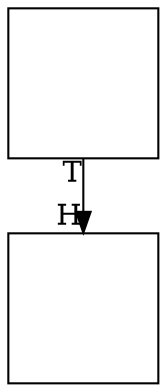

# `getLayout()` exposes no `tailLabel`/`headLabel` positions

**Impact:** the last place in `plantuml-ts`'s `src/` that reads the engine's
**rendered output as text**. `src/core/graph-layout.ts` regex-scans the SVG
string `render()` returns to recover the positions of edge tail/head labels,
because the geometry snapshot does not carry them. That is a coupling to a
serialization format no API contract governs, and it has already cost this
project once: the sibling scraper in `frontier-shadow-layout.ts` broke on
dot-engine 1.2.x when node attributes started wrapping one per line, and the
failure surfaced as six description fixtures comparing a PlantUML **error
diagram** against their oracle rather than as anything resembling a parse
error.

This is the same shape as **issue 06** (`getLayout()` exposed no cluster
geometry), which is now fixed — `clusters[]` landed, and the workaround it had
forced was deleted the same day the engine bump landed here. This issue asks
for the equivalent on edges.

## Finding

`EdgeGeometry` (`dist/api/geometry.d.ts`) carries:

```ts
export interface EdgeGeometry {
    tail: string;
    head: string;
    points: { x: number; y: number }[];
    label?: { x: number; y: number };   // centre label only
}
```

`label` is the **centre** edge label (`ED_label`). There is no field for the
tail/head labels, even though the same layout call already computes them:
`gvPostprocess` → `addXLabels` (`label/xlabels.ts`) places them whenever an
edge carries a `taillabel`/`headlabel` attribute, and `render()` then emits
them as `<text>` elements. The data exists inside the engine at snapshot time
and is simply not published.

Upstream graphviz stores these on the edge as `ED_head_label` / `ED_tail_label`
(`lib/common/types.h`), alongside `ED_label` which `EdgeGeometry.label` already
exposes.

## What the consumer is forced to do today

`src/core/graph-layout.ts`:

1. `parsePortLabelBlocks(svg)` — regex `<g id="edge\d+" class="edge">` blocks,
   read the `<title>` for the `tail->head` pair, then regex every `<text x= y=>`
   inside.
2. `pickPortLabelTexts(block, attrs)` — reconstruct which `<text>` is which by
   **emit order** ("label, xlabel, head, tail"), skipping the centre-label slot
   only when the input attr was a non-empty string.
3. `parseNodeRenderCenters(svg)` + `computeRenderOffset(...)` — a whole second
   scraper, needed only because the positions recovered in (1) are in
   `render()`'s raw SVG frame rather than `getLayout()`'s, so a constant
   translation has to be derived by matching node centres between the two.

Steps (1) and (2) depend on emit ORDER and on markup shape; step (3) exists
purely to bridge two coordinate frames that a snapshot field would have
reported in the right one to begin with. All three disappear if
`EdgeGeometry` gains the positions.

## Requested API

```ts
export interface EdgeGeometry {
    tail: string;
    head: string;
    points: { x: number; y: number }[];
    label?: { x: number; y: number };
    tailLabel?: { x: number; y: number };   // ED_tail_label
    headLabel?: { x: number; y: number };   // ED_head_label
}
```

Same frame convention as the rest of the snapshot (`yAxis` honoured), same
"absent when not present" semantics `label` already uses. No new options and no
behaviour change — this is publishing a value the layout already produced.

## Repro

Any edge with `taillabel`/`headlabel` set. Minimal:



`render(g, 'svg')` emits both labels as `<text>`; `getLayout(g)` reports the
edge with `points` and no label fields at all.

## Verification when it lands

Delete `parsePortLabelBlocks`, `pickPortLabelTexts`, `parseNodeRenderCenters`
and `computeRenderOffset` from `src/core/graph-layout.ts`, read the two
positions from the snapshot instead, and confirm the description gates are
byte-identical: component 262/262, usecase 93/93, description census 26/358.
The port-label fixtures under `docs/graphviz-issues/12-port-label-placement-
near-head-node.md` are the ones that exercise this path.

Note the distinction that keeps this honest: `graph-layout.ts` ALSO parses
`points="…"` out of node polygons, and that one **stays** — it is the port of
upstream PlantUML's own `SvgResult#extractList`
(`svek/SvgResult.java:52,67-77`), which text-parses graphviz's SVG because
graphviz is an external process there. Only the tail/head-label scraping is a
workaround for a missing API, and only it should go.
