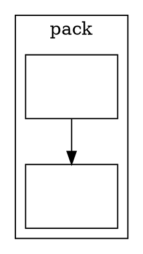

# `getLayout()` exposes no cluster label position

**Impact:** blocks porting upstream PlantUML's own cluster-title placement.
`DotStringFactory#solve` reads a cluster's title position straight out of
graphviz's SVG — `cluster.setTitlePosition(SvekUtils.getMinXY(pointsTitle))`
(`svek/DotStringFactory.java:436-439`) — and `Cluster#drawUState` then draws the
title block there. `plantuml-ts` cannot mirror that, because the geometry
snapshot reports a cluster's box but not where the engine put its label. The
class engine consequently computes its own title baseline from a
`StringMeasurer` instead of reading the laid-out one, which is an
approximation of a value the layout already produced.

This completes a pair the engine has already half-answered. **Issue 05**
(`cluster-label-dimensions-ignored`) made the engine reserve space for a
cluster label; **issue 06** (`cluster-bbox-not-in-getlayout`) published the
cluster box. This asks for the third value in the same family — the position
that reservation resolves to.

## Finding

`ClusterGeometry` (`src/api/geometry.ts`) carries:

```ts
export interface ClusterGeometry {
  /** Cluster subgraph name (e.g. `cluster6`); encodes nesting. */
  name: string;
  x: number;
  y: number;
  width: number;
  height: number;
}
```

The label position is computed on the very same layout call and then dropped.
`placeGraphLabel` (`src/layout/dot/position-bbox.ts:208-217`, a port of
`lib/common/postproc.c:place_graph_label`) walks every non-root cluster
depth-first and sets `g.info.label.pos`, marking `set = true`:

```ts
export function placeGraphLabel(g: Graph): void {
  if (g !== g.root) {
    const lab = g.info.label as TextlabelT | undefined;
    if (lab && !lab.set) {
      lab.pos = (g.root.info.flip ?? false) ? placeLabelFlip(g) : placeLabelNonFlip(g);
      lab.set = true;
    }
  }
  const nClust = g.info.n_cluster ?? 0;
  for (let c = 0; c < nClust; c++) placeGraphLabel(g.info.clust![c]!);
}
```

`position.ts:190` calls it during `dot` positioning, so the value exists at
snapshot time. `render()` emits it as a `<text>`; `getLayout()` does not
publish it. `TextlabelT` (`src/common/types.ts`) already carries both `pos`
(centre of the label space) and `dimen` (its size).

Upstream graphviz stores the same value as `GD_label(sg)->pos`
(`lib/common/types.h:textlabel_t.pos`), alongside `GD_bb` which
`ClusterGeometry`'s `x`/`y`/`width`/`height` already expose.

## What the consumer is forced to do today

Unlike issue 13, there is no scraper to delete here — there is a gap. The
class engine (`src/diagrams/class/class-geo-builders.ts#buildNamespaceGeos`)
measures the title text itself and derives a baseline offset, rather than
reading the position the engine assigned. Any divergence between the engine's
label placement and that re-derivation lands directly in the rendered SVG, and
the only way to detect it is oracle comparison after the fact.

Scraping `render()`'s SVG is not a viable stopgap: the `<text>` it emits
carries no cluster identity, so recovering which label belongs to which
cluster would mean matching on emit order — the exact fragility issue 13
documents.

## Requested API

```ts
export interface ClusterGeometry {
  name: string;
  x: number;
  y: number;
  width: number;
  height: number;
  /** Centre of the label space, and its size. @see GD_label(sg)->pos / ->dimen */
  label?: { x: number; y: number; width: number; height: number };
}
```

Same frame convention as the rest of the snapshot (`yAxis` honoured — note the
internal value is in graphviz's y-up frame, see the repro below), and the same
"absent when not present" semantics `EdgeGeometry.label` already uses: omit it
when the cluster has no label or when `set` is false. No new options and no
behaviour change — this publishes a value the layout already produced.

## Repro



Measured on dot-engine **1.4.0** (installed and npm-latest at the time of
filing):

```
getLayout clusters: [{"name":"cluster0","x":8,"y":8,"width":88,"height":177.6}]
internal label:     {"text":"pack","pos":{"x":52,"y":173.2},
                     "dimen":{"x":26.427734375,"y":16.8},"set":true}
rendered <text>:    <text ... x="52" y="-169" font-size="14.00">
```

The snapshot's cluster entry has no label field; `g.info.clust[0].info.label`
has a set position and a measured size; `render()` emits it. Three views of
one layout, and only two of them are reachable through the API.

## Verification when it lands

`buildNamespaceGeos` reads `cluster.label` from the snapshot instead of
re-measuring, and the class/object package fixtures re-measure clean. The
mission that consumes this is `plans/namespace-cluster-box/`; its own
measurement harness (fixtures matching jar's document size exactly, and
rigid-aligned matching shapes across the 1069-fixture cache) is the gate. The
126 fixtures carrying a cluster in jar's cached DOT are the ones that exercise
this path — `cidepu-54-bemo048`, `jinibe-02-tebi269` and `dopuzi-50-muxo994`
are the smallest.
