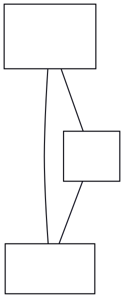

# dot-engine mirrors a same-rank node order that both the jar and real graphviz agree on

**Impact:** 2 of the 723 class fixtures in the ratchet corpus:
`class/boseba-99-zopo693` (1 structural + 681 numeric diffs) and
`class/majuva-44-luta965` (1 structural + 114 numeric diffs). Filed by
plantuml-ts mission `class-divergence-drive`, task T37 (batch 10, M8's
`boseba`/`majuva` reroute question).

**Finding.** For both fixtures, `npx jiti scripts/dot-sync-report.ts
--slug <slug> class` reports `structurallyEqual=true` — our emitted DOT
is byte-identical (module color/hex-case aside, issue already tracked
separately) to the jar's own cached `svek-N.dot`. Feeding that SAME
cached DOT to a real graphviz 16.1.0 binary (`dot -Tplain svek-1.dot`)
and comparing against both the jar's rendered SVG and our own render:

- `majuva-44-luta965` (`Dog --|> Mammal`, `Dog o-- Cat`, `Cat --|>
  Mammal` — a 3-node graph where every pair has an edge): real
  graphviz's raw bbox is `1.5423in` wide (`111.0pt`), matching the
  jar's final SVG width (133px, margins accounted for) almost exactly.
  dot-engine's own layout (as consumed by this port) renders at 173px
  final width — 40px wider, with `sh0008` (Cat) pushed further right
  than either the jar or real graphviz place it.
- `boseba-99-zopo693` (`skinparam nodesep 60`, a `together{}` block
  plus three siblings `UserPerso`/`UserPro`/`UserSpace` extending
  `User`): real graphviz's raw bbox is `9.7035in` (`698.65pt`), matching
  the jar's final SVG width (704px) almost exactly. dot-engine renders
  at 795px — 91px wider. Directly comparing rendered node x-positions
  for the three `User` children:

  | node (DOT id) | jar x | real-graphviz rank order | dot-engine (ours) x |
  |---|---|---|---|
  | UserPerso (sh0007) | 286.87 (leftmost) | 1st (x=4.79) | 681.86 (RIGHTMOST) |
  | UserPro (sh0008) | 445.26 (middle) | 2nd (x=6.89) | 538.26 (middle) |
  | UserSpace (sh0009) | 588.29 (rightmost) | 3rd (x=9.00) | 377.29 (LEFTMOST) |

  The jar and a fresh real-graphviz run AGREE on the left-to-right
  order (`sh0007 < sh0008 < sh0009`); dot-engine's `getLayout()`
  returns the EXACT MIRROR of that order for the same rank on the
  same input graph. Node sizes and all other ranks are unaffected —
  only this one rank's left-right order flips.

This is a same-rank node-ordering (mincross tie-break) divergence: the
DOT input is byte-identical and every individual node's own dimensions
match, but dot-engine resolves a different (mirrored) horizontal order
among nodes at the same rank than real graphviz picks, which then
cascades into a wider canvas and a different-looking edge route for
the edges attached to the reordered nodes (`majuva`'s `Dog o-- Cat`
edge takes a visibly different path as a direct, downstream
consequence — not an independent edge-routing bug; T37's own
`render-diff` confirms `structural=1` is this ONE path element, with
every other structural check passing and every numeric diff explained
by the uniform node-position shift).

## Repro DOT

`majuva-44-luta965`'s full cached `svek-1.dot` (3 nodes, one edge per
node pair):

`dot -Tplain` on this file (real graphviz 16.1.0): `sh0006` and
`sh0007` share x=`0.61319`; `sh0008` sits at x=`1.1688` — a compact,
~40px-narrower layout matching the jar. dot-engine's `getLayout()` on
the identical graph places `sh0008` further out, widening the bbox by
the same ~40px this fixture's `render-diff` reports.

## Procedure

1. `npx jiti scripts/dot-sync-report.ts --slug boseba-99-zopo693 class`
   / `--slug majuva-44-luta965 class` — confirms `structurallyEqual:
   true`, `maxSizeDeltaIn: 0.0000` (DOT emission is not the cause).
2. `dot -Tplain test-results/dot-cache/class/<slug>/svek-1.dot` (real
   graphviz 16.1.0, installed via Homebrew) — compare node x-positions
   against the jar's rendered `<rect>` x-attributes (converting pt to
   the jar's px via the ratio implied by the two canvas widths) and
   against `plans/class-divergence-drive/measurements/out/<slug>.ours.svg`.
3. `npx jiti plans/class-divergence-drive/tools/render-diff.mts <slug>`
   — the ONE structural diff is the rerouted edge path; every numeric
   diff is explained by the uniform node-position shift (no unexplained
   residual once ordering is accounted for).

## Status

Un-fixed. Not chased further into dot-engine's own mincross/ordering
source per this mission's stop-8 budget (one diagnosis pass). No
plantuml-ts change is warranted — the DOT input is already correct.
