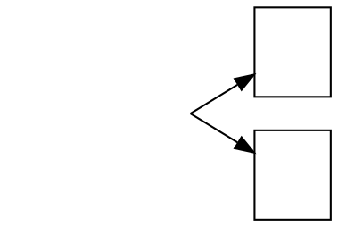

# `sametail`/`samehead` port on a plaintext/HTML node clips 1.5px outside the boundary under `rankdir=LR`

**Impact:** `class/pijiju-95-xexi872`. Filed by plantuml-ts mission
`class-divergence-drive-3`, task T6 (diagnosed as E2-6 in
`plans/class-divergence-drive-3/diagnosis/E2.md`).

**Finding.** When two edges share a `sametail=x` (or `samehead`) group and
the shared node is `shape=plaintext` with an HTML `<TABLE>` label, under
`rankdir=LR` dot-engine clips the group's shared start point **1.5px
outside** the node's own boundary. Real graphviz clips it exactly on the
boundary. Both engines agree on the node's own position and size; only the
synthesized shared port differs.

Controls isolate the trigger to the combination of **plaintext/HTML shape
AND `rankdir=LR`** — either alone reproduces real graphviz exactly:

| variant | shape | rankdir | matches real dot? |
|---|---|---|---|
| `E2-sametail-min.dot` | plaintext + HTML table | LR | **NO** (+1.5px) |
| `E2-sametail-min-rect.dot` | rect (same footprint) | LR | yes |
| `E2-sametail-min-tb.dot` | plaintext + HTML table | TB | yes |

## Repro



Re-verified 2026-09-25 against real graphviz 16.1.0 (`/opt/homebrew/bin/dot`)
and the pinned `@knowvah/dot-engine` 1.6.0, both `-Tdot`:

```
$ dot -Tdot repro.dot                                    # real
a -> b [pos="e,132.79,78.393 97,57.12 97,57.12 109.84,64.753 123.17,72.676", sametail=x];
a -> c [pos="e,132.79,35.847 97,57.12 97,57.12 109.84,49.487 123.17,41.564", sametail=x];

$ node dot-engine-render.mjs repro.dot dot                # dot-engine 1.6.0
a -> b [pos="e,132.71,78.019 98.5,57.12 98.5,57.12 110.43,64.411 123.08,72.138", sametail=x];
a -> c [pos="e,132.71,36.221 98.5,57.12 98.5,57.12 110.43,49.829 123.08,42.102", sametail=x];
```

`a`'s own `pos="48.5,107"` is identical on both engines; the shared start
point is `97,57.12` (real) vs `98.5,57.12` (dot-engine) — a constant +1.5px
in x, on both grouped edges.

On the fixture itself (`test-results/dot-cache/class/pijiju-95-xexi872/svek-1.dot`,
byte-identical DOT input to both engines — diffing it against dot-engine's own
`-Tdot` re-emission shows only whitespace): `sh0007 pos="48.5,107"` identical;
edge `sh0007 -> sh0008` starts at `97,93` (real) vs `98.5,93` (dot-engine),
`sh0007 -> sh0009` likewise. The +1.5 propagates unchanged into the
`Neighborhood` triangle/stub (drawn from the contact point verbatim) and every
downstream path/control-point/polygon coordinate on this fixture's grouped
`sametail` edges.

**Ruled out (falsified — don't chase):** our DOT emission (identical to the
cached oracle DOT, confirmed by diff); rankdir alone (the TB control matches);
node shape alone (the rect control matches) — only the LR + plaintext/HTML
combination triggers it; the Neighborhood/edge-geometry code downstream of the
contact point (it takes the contact point verbatim, so a 1.5px input error
becomes a 1.5px output error with no amplification of its own).

**Suspected graphviz C source area:** `lib/dotgen/sameport.c` (read
2026-09-25) — the shared port for a `sametail`/`samehead` group is
synthesized around line 143-149 by driving a straight Bezier from the node
center to a far point, calling `shape_clip(u, curve)`, and rounding the
clipped point to get the port. For a `shape=plaintext` node (`peripheries=0`,
no polygon boundary — its "shape" is the HTML table's own box) under
`rankdir=LR` (where the node's internal geometry is pre-rotated before
`shape_clip` runs), that clip is the likely site of the 1.5px discrepancy.
Not traced further into `shape_clip`'s own HTML-label branch — this is the
call site, not a proven line-level cause inside dot-engine's port.

**Workaround in plantuml-ts:** none applied; any compensation here would be
fitting a number the engine should produce, and the residual is small
(single fixture, sub-triangle geometry only).
