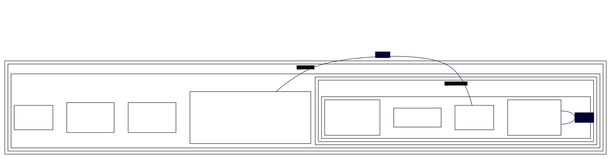

# Self-loop spline geometry differs from real graphviz when the node sits in a cluster alongside a flat labelled edge

**Impact:** `class/cobumi-83-bapu892` (residual after the plantuml-ts-side
`Bibliotekon#addLine` lines0-insertion-order fix, E3-18). Filed by plantuml-ts
mission `class-divergence-drive-3`, task T6 (diagnosed as E3-D1 in
`plans/class-divergence-drive-3/diagnosis/E3.md`).

**Finding.** A self-loop edge (`sh0019->sh0019`) inside a cluster that also
contains a labelled flat (`minlen=0`) edge (`sh0018->sh0010`) routes with a
different vertical extent in dot-engine than in real graphviz, on
byte-identical DOT input. A lone self-looped node, or a self-looped node
alone in an otherwise-empty cluster, does **not** reproduce the divergence —
it requires the combination of (a) the node being inside a cluster and (b) a
labelled flat edge elsewhere in that cluster's subgraph.

## Repro (bisected from `cobumi-83-bapu892`'s cached `svek-1.dot` to 13 lines)



Re-verified 2026-09-25, real graphviz 16.1.0 vs dot-engine 1.6.0, both
`-Tdot`, `sh0019 -> sh0019` `pos=`:

```
real:   lp="250.56,101" pos="192.05,117.81 211.53,117.15 226.56,111.55 226.56,101 226.56,90.453 211.53,84.85 192.05,84.191"
engine: lp="250.56,101" pos="192.05,130.79 211.53,129.62 226.56,119.69 226.56,101 226.56,82.309 211.53,72.379 192.05,71.211"
```

`lp` and both x-columns are identical. Every y off the centre line
(`226.56,101`) is uniformly offset by exactly `12.98`: `117.81→130.79`,
`111.55→119.69`, `90.453→82.309`, `84.85→72.379`, `84.191→71.211` (signs
flip across the centre, magnitude constant) — the self-loop is drawn taller/
more asymmetric in dot-engine than in real graphviz.

Controls that do **not** reproduce it (from the bisection): a lone
self-looped node with no cluster (`E3-selfloop-min.dot`) and a self-looped
node alone inside an otherwise-empty cluster (`E3-selfloop-cluster.dot`) —
both give 0 diffs between the two engines.

**Ruled out (falsified — don't chase):** DOT content (the only difference
between the jar's cached DOT and our emitted DOT for this fixture is one
line's position in the edge list, confirmed by `E3-dotseq.py`); the
`Bibliotekon#addLine` insertion-order fix itself (E3-18, plantuml-ts-side,
already the mission's fix for this fixture's *other* divergence — this
self-loop delta is a separate residual on top of it).

**Suspected graphviz C source area:** self-loop routing in
`lib/dotgen/dotsplines.c` (not read this pass beyond the flat-labelled-edge
function cited in issues 23/24 — the self-loop path is a distinct code path,
not traced) interacting with cluster-local rank/box geometry once a
labelled flat edge is also present in the same cluster subgraph; not
isolated further than the bisected 13-line repro above.

**Workaround in plantuml-ts:** none applied; filed per stop 8 (one
diagnosis pass, not chased into dot-engine's own source).
