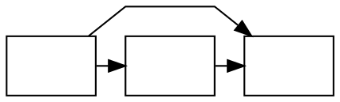

# A flat edge between non-adjacent nodes ignores `splines=polyline` / `splines=line`

**Impact:** `unknown/deroxu-29-gude369` (the DOT carries `splines=polyline;`).
Engine: `@knowvah/dot-engine` 1.6.1 vs real `dot` 16.1.0 (the oracle's
version). Found by plantuml-ts mission `large-group-mirror`, task T0c, by
feeding every cached jar layout input to both engines.

**Finding.** When two nodes on the same rank are not neighbours (a node sits
between them) and an edge joins them, real graphviz routes that edge through
the three-box corridor over the top of the rank with `routepolylines` unless
`splines` is `spline`, and with a straight `makeSimpleFlat` line for
`splines=line`. dot-engine 1.6.1 draws the same corridor with the smooth
spline router for every `splines` value: the `splines=polyline` flat edge comes
out as a curve (2 Bezier segments, with off-corridor control points) instead of
a polyline (3 straight-segment Beziers with repeated control points), and the
`splines=line` flat edge is still an arc over the top instead of a straight
line. Non-flat edges and flat edges between neighbours honour the attribute (the
edge in issue 03's repro and the unrelated neighbour edges in this repro match
byte for byte).

The attribute is not lost at the graph level: the same graph without the
flat non-adjacent edge matches real dot exactly.

## Repro



`dot -Tsvg` (exit 0), the `a -> b` edge:

```
M50.03,-36.42C61.1,-45.28 72,-54 72,-54 72,-54 126,-54 126,-54 126,-54 131.88,-49.3 139.39,-43.29
```

`renderSvg(src, 'dot')`:

```
M44.08,-36.22C51.85,-43.2 61.62,-50.36 72,-54 94.65,-61.94 103.35,-61.94 126,-54 132.82,-51.61 139.36,-47.7 145.26,-43.33
```

The `a -> x` and `x -> b` paths are identical in both. With `splines=line` the
same input draws, in real dot, the straight
`M54.28,-18C80.35,-18 106.41,-18 132.47,-18` for `a -> b`; dot-engine returns
the same arc as above.

A port on either end (`a:s -> b:s`, `a:n -> b:n`) and `a -> b [minlen=0]` on
the rank-collapsed layout reproduce it too; a labelled flat edge does not (it
goes through a different function, see issue 23 / 24).

## Suspected graphviz C source

`lib/dotgen/dotsplines.c#make_flat_edge` (line numbers from the local
checkout, graphviz 15.0.0-82 of 2026-06-10, **not** the 16.1.0 source):

- `if (et == EDGETYPE_LINE) { makeSimpleFlat(...); return 0; }` at ~1535.
- the unlabelled corridor loop ends `if (et == EDGETYPE_SPLINE) ps =
  routesplines(P, &pn); else ps = routepolylines(P, &pn);` at ~1603-1607.
- the same `routesplines` / `routepolylines` choice repeats in
  `make_flat_bottom_edges` (~1479) and `make_flat_labeled_edge` (~1405).

dot-engine's flat-edge routing appears to call the spline router in the
`make_flat_edge` top-corridor branch regardless of `et`. Confidence: MEDIUM
(the symptom is exactly "branch taken, `et` test not honoured"; the dot-engine
source was not read).

Relation to existing issues: issue 03 (marked fixed) covers the regular
inter-rank edge path of `splines=polyline`; this is the flat-edge branch it
did not reach.
