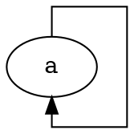

# `splines=ortho` drops a self-loop edge that real graphviz draws

**Impact:** `unknown/xagonu-36-sudi116` (carries `splines=ortho;
forcelabels=true;` and a self-loop `zaent0019 -> zaent0019` with an xlabel).
Engine: `@knowvah/dot-engine` 1.6.1 vs real `dot` 16.1.0. Found by plantuml-ts
mission `large-group-mirror`, task T0c.

**Finding.** Under `splines=ortho` real graphviz routes a self-loop as an
orthogonal rectangle round the node. dot-engine reports `lost a a edge` and
emits **no `<path>`** for it, and since the missing loop no longer reserves
space the canvas is smaller. In the xagonu fixture the graph comes out
6 px narrower (`unix` bb 1019 vs 1025, clusters x-shifted by 6); the minimised
fixture still contains the lost loop with its xlabel, and the repro below shows
the same loss on a single node. Attributing the full 6 px to the missing loop
is likely but was not isolated separately.

Without `ortho` (`splines=polyline`, `splines=line`, the default) the
self-loop is identical in both engines, so the loss is specific to the ortho
router's handling of a loop.

## Repro

- `dot -Tsvg` (exit 0): `svg width="80pt" height="80pt"` and
  `<path d="M27,-54.42C27,-63.28 27,-72 27,-72 27,-72 72,-72 72,-72 72,-72 72,0 72,0 72,0 27,0 27,0 27,0 27,-6.06 27,-6.06"/>`
  (plus the arrowhead polygon).
- `renderSvg(src, 'dot')`: logs `lost a a edge`, returns an SVG of
  `width="80pt" height="44pt"` with no edge element.

Adding `a -> b` keeps the effect (`a -> a` is still lost; real draws it):
`digraph g { splines=ortho; a -> b; a -> a; }`.

## Suspected graphviz C source

`lib/ortho/ortho.c` handles loops explicitly: `addLoop` (~412-440) adds the two
temporary nodes for a loop at a cell, and the call site at ~1246 builds the
sgraph route. The symptom ("edge lost") suggests dot-engine's port of that
loop path returns failure (or is never entered) for `tail == head`.
Confidence: LOW (source pointer is by function name only; neither the loop
path in dot-engine nor the 16.1.0 ortho source was traced; checkout is
graphviz 15.0.0-82).
