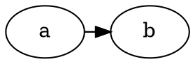

# Adjacent flat edges where one carries a port: the port-less edge's endpoints differ by ~0.2 px

**Impact:** `class/sokevu-87-toce485` (0.1-0.3 px on `sh0011->sh0012`) and
`component/repoge-41-demu604` (0.2-0.7 px on two edges). Engine:
`@knowvah/dot-engine` 1.6.1 vs real `dot` 16.1.0. Found by plantuml-ts mission
`large-group-mirror`, task T0c.

**Finding.** Two flat (same-rank) edges join the same pair of adjacent nodes;
at least one has a port. Real graphviz handles the whole group by laying out an
auxiliary graph recursively (`make_flat_adj_edges`) and copying the splines
back. The edge **without** a port comes back from that auxiliary layout with
endpoints 0.17-0.18 px different in dot-engine; the edge with the port matches
exactly. Nodes and everything else are identical.

## Repro



`dot -Tsvg` (exit 0), the two edge paths:

```
M54.46,-18C56.43,-18 58.44,-18 60.46,-18
M54,-18C56.75,-18 58.79,-18 60.61,-18
```

`renderSvg(src, 'dot')`:

```
M54.28,-18C56.28,-18 58.28,-18 60.29,-18
M54,-18C56.75,-18 58.79,-18 60.61,-18
```

Needed: both edges flat and adjacent, one with a port (`rank=same` or
`minlen=0`). `rankdir=LR`, a port on a non-flat pair, or equal ports on both do
not reproduce. The minimal pair of fixtures keeps the shape: a chain of flat
nodes in a cluster plus a back edge `c:P->b:P` where `P` is an HTML-table port.

## Suspected graphviz C source

`lib/dotgen/dotsplines.c#make_flat_adj_edges` (~1122-1290 in the local
15.0.0-82 checkout, not the 16.1.0 source): when any edge has a port it clones
the two nodes into an aux graph, gives the port-less edge `weight=10000`
(`hvye`), runs `dot_rank`/`dot_mincross`/`dot_position`/`dot_splines_` on it
and transforms the result with `transformf`. The port-less edge is that
"hvye" edge, so its endpoints depend on the aux layout's coordinates and
clipping. Confidence: LOW as to which step differs (not traced into
dot-engine); MEDIUM that this function is where the port-less edge's geometry
comes from. Related but distinct: issues 19 (flat edge ignores an HTML-table
port) and 22 (sametail port clip offset).
