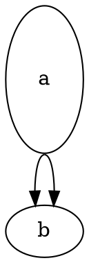

# NOT A DEFECT: graphviz "rejects" two cached inputs by exit status only (routing failure), dot-engine returns the same SVG

**Reclassified at filing (large-group-mirror T0c, 2026-10-08):** records the two
inputs real `dot` appeared to reject. Same-class check against issue 27 below.

**Impact:** `class/zuduxu-90-kosi876`, `unknown/rubebe-45-sura795`.

**Finding.** Both inputs make graphviz's spline router fail
(`Pshortestpath failed`, edge "lost"). Real `dot -Tsvg` prints the errors to
stderr, **still writes a complete SVG to stdout**, and exits 1. dot-engine
prints the same failures to the console and returns the SVG normally. A harness
that treats non-zero exit as rejection (execFileSync) sees "real rejects,
dot-engine accepts"; the outputs are not different:

- zuduxu: edge `sh0006->sh0008` is lost in both; SVG body identical apart from
  generator comments and whitespace.
- rubebe: 34 `lost ... edge` lines in both, identical sets; the concatenated
  edge `d=` attributes are byte-identical (same md5); 249 edges in both.
  dot-engine logs 36 `Pshortestpath failed` lines vs real's 34 (the lost-edge
  sets still match). The only SVG differences are the generator comments and
  the draw order of an HTML table's two polygons (issue 34).

This is **not** the issue 27 class. Issue 27 is the parser accepting syntax
graphviz refuses (dot-engine succeeds where graphviz produces *no* output).
Here graphviz produces output and fails the same routes; there is no
acceptance difference, only the process exit status, which a library
`renderSvg` has no equivalent for.

Exact graphviz text (16.1.0), zuduxu:

```
lib/pathplan/shortest.c:333: triangulation failed
lib/pathplan/shortest.c:193: destination point not in any triangle
Error: in routesplines, Pshortestpath failed
Error: lost sh0006 sh0008 edge
Error: lost sh0006 sh0008 edge
```

rubebe adds first `Warning: table size too small for content` / `in label of
graph cluster6`, then 34 repetitions of the same triple plus `lost <a> <b>
edge`.

## Repro (graphviz itself fails; both engines lose the same edges)



`dot -Tsvg`: exit 1, the five stderr lines above (with `a`/`b`), SVG with two
nodes and no edge. `renderSvg(src, 'dot')`: console shows `triangulation
failed` / `in routesplines, Pshortestpath failed` (three times) and `lost a b
edge` (twice); same two-node SVG. Height 1.4 or 2 does not fail; it is a
specific `height` plus two `sametail` edges.

Nothing to fix in dot-engine unless library error surfacing is wanted.
