# Parallel labelled flat edges between adjacent nodes: the detour edge is the exact mirror image of real graphviz's

**Impact:** `component/zosuje-43-zebi775` and `unknown/bamami-10-lava790`,
`bobixe-18-riza923`, `pugodi-27-kone040`, `rufopi-30-roro642` (the four
`unknown` dots are the same graph with different colours). Engine:
`@knowvah/dot-engine` 1.6.1 vs real `dot` 16.1.0. Found by plantuml-ts mission
`large-group-mirror`, task T0c.

**Finding.** Two or more `minlen=0` edges join the same adjacent pair, at least
two carrying labels. Real graphviz routes the first (widest-label) edge
straight and sends each further labelled edge round its own label box. For some
label-width combinations dot-engine's detour edge is the exact mirror image
(reversed and flipped in x about the label centre) of real's; node positions,
label positions and the straight edge are identical. Same symptom family as
issue 23, but this is the adjacent-pair function, not the corridor one.

Mirror check on the fixtures (sum of mirrored x constants):
zosuje real `M50.25 ... 117.58` vs dot-engine `M50.42 ... 117.75`
(50.25+117.75 = 117.58+50.42 = 168); bamami real `M46.87 ... 129.92` vs
dot-engine `M47.08 ... 130.13` (46.87+130.13 = 129.92+47.08 = 177).

## Repro

```dot
digraph g {
nodesep=0.486111;
node [shape=rect,label="",width=0.25,height=0.25];
a -> b [minlen=0,arrowhead=none,arrowtail=none,label=<<TABLE FIXEDSIZE="TRUE" WIDTH="6" HEIGHT="15"><TR><TD></TD></TR></TABLE>>];
a -> b [minlen=0,arrowhead=none,arrowtail=none,label=<<TABLE FIXEDSIZE="TRUE" WIDTH="15" HEIGHT="15"><TR><TD></TD></TR></TABLE>>];
}
```

`dot -Tsvg` (exit 0), the detour edge:
`M18.35,-10.48C25.6,-4.69 36.07,1.34 46,-1.34 53.81,-3.44 61.68,-8.05 67.54,-12.08`

`renderSvg(src, 'dot')`:
`M18.46,-12.08C24.32,-8.05 32.19,-3.44 40,-1.34 49.93,1.34 60.4,-4.69 67.65,-10.48`

The straight edge is `M18.46,-19.34C31.45,-19.34 54.68,-19.34 67.63,-19.34` in
both. Mirror: 18.35+67.65 = 67.54+18.46 = 86.0; the Bezier join is at x=46 in
real, x=40 in dot-engine (46+40 = 86). Label widths 6 and 11, or 42/6/11/15,
agree; 6 and 15 mirror.

## Suspected graphviz C source

`lib/dotgen/dotsplines.c#makeSimpleFlatLabels` (944-1073, local 15.0.0-82
checkout, not 16.1.0): builds an 8-point polygon symmetric about the label box
and calls `simpleSplineRoute` -> `Proutespline`. In
`lib/pathplan/route.c#reallyroutespline` (~97-155) the spline is split at the
polyline vertex of maximum distance with a strict `>`; in a polygon symmetric
about the label centre the two label-box corners are equidistant, so which one
becomes the Bezier join is decided by floating-point noise. The mirrored result
is consistent with that tie resolving the other way. Confidence: MEDIUM-LOW
(hypothesis from the symmetry and the strict comparison; not confirmed by
instrumenting either engine). Same hypothesis as issues 23 and 33.
