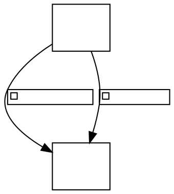

# Parallel labelled edges between ranked nodes: the second edge's Bezier join sits at a different vertex

**Impact:** `component/xenusu-76-sabi405` (3 parallel labelled edges,
`minlen=1`). Engine: `@knowvah/dot-engine` 1.6.1 vs real `dot` 16.1.0. Found by
plantuml-ts mission `large-group-mirror`, task T0c.

**Finding.** Two or more edges join the same nodes on adjacent ranks, each with
a label. For some `nodesep`/`ranksep` and label widths the first edge is
identical but the second bows to the same side with the Bezier join at a
different point along the label box: in the repro real puts the join at
`(89.12,-80)` and dot-engine at `(89.12,-94)`, i.e. the other end of the label
box (y-reflection about the label centre line); start and end points differ by
1.5-1.7 px as a consequence. In the original fixture dot-engine's curve is the
exact y-mirror of real's (join y -74 vs -88, sum -162). Node, label and canvas
geometry are identical. Whether this is the same tie-break as issue 32/23 or a
distinct bug is not established.

Sweeps showed it is sporadic: `nodesep`/`ranksep` pairs (0.5,0.5),
(0.6,0.8..1.2), (0.8,1.2), (0.25,1.0) differ; most others agree.

## Repro

`dot -Tsvg`, second edge: `M81.58,-129.76C86.73,-115.75 91.59,-96.93 89.12,-80 87.92,-71.8 85.81,-63.15 83.47,-55.13`

`renderSvg(src, 'dot')`: `M80.08,-129.68C83.61,-119.11 87.36,-106.06 89.12,-94 90.99,-81.17 88.65,-67.25 85.17,-55.17`

The first edge `M44.68,-136.45C29.38,-126.69 ... 35.16,-40.7` is identical.

## Suspected graphviz C source

`lib/dotgen/dotsplines.c#make_regular_edge` multi-edge loop (offsets by
`sp.Multisep`) then `routesplines` -> `lib/pathplan/route.c#reallyroutespline`
split-vertex choice (strict `>` max-distance, ~135-145). Confidence: LOW
(the join-vertex symptom matches issue 32's, the multi-edge path was not
traced). Local checkout is 15.0.0-82, not the 16.1.0 oracle source.
