# Parallel edges with a very narrow label: all x coordinates sit 0.226 px apart from real graphviz

**Impact:** no cached fixture isolates it (found while minimising
`unknown/bamami-10-lava790`; the fixture's own difference is issue 32).
Engine: `@knowvah/dot-engine` 1.6.1 vs real `dot` 16.1.0. Found by plantuml-ts
mission `large-group-mirror`, task T0c.

**Finding.** Two parallel edges `a -> b`, one with a 6-pt wide HTML-table
label, one plain. Real places node centres, the label and the canvas on a
fractional x (centre 10.774, canvas 27.77 wide); dot-engine lands them on an
integer (centre 11, canvas 28). Everything shifts by 0.226 px and the labelled
edge's spline has a different shape. Widths 2, 4, 6, 8, 12 and 14 differ; 10, 16,
18, 24 and 30 agree.

## Repro

```dot
digraph g {
nodesep=0.486111;
node [shape=rect,label="",width=0.25];
a -> b [label=<<TABLE FIXEDSIZE="TRUE" WIDTH="6" HEIGHT="15"><TR><TD></TD></TR></TABLE>>];
a -> b;
}
```

`dot -Tsvg`: canvas polygon `-4,4 -4,-127 23.77,-127 23.77,4 -4,4`, node `a`
`19.77,-123 1.77,-123 1.77,-87 19.77,-87`, plain edge
`M10.77,-86.8C10.77,-75.58 10.77,-60.67 10.77,-47.69`, labelled edge
`M4.46,-86.96C1.62,-77.33 -0.77,-65.05 0.77,-54 1.08,-51.79 1.5,-49.53 1.98,-47.27`.

`renderSvg(src, 'dot')`: canvas `-4,4 -4,-127 24,-127 24,4 -4,4`, node `a`
`20,-123 2,-123 2,-87 20,-87`, plain edge `M11,-86.8C11,-75.58 11,-60.67 11,-47.69`,
labelled edge `M5.05,-86.76C3.39,-81.16 1.83,-74.88 1,-69 0,-61.84 0.66,-54.15 2.01,-47.01`.

## Suspected cause

Same family as issue 02 (integer vs fractional centring): real's graph box
appears to be anchored on the labelled edge's extent (the spline reaches
x about 0 and the box is translated to it), giving a fractional node x.
Not traced into either source. Confidence: LOW. Real graphviz also warns
`table size too small for content` for this label (dot-engine does not).
