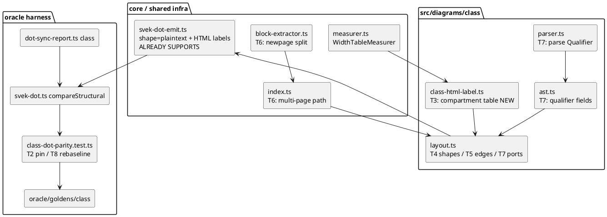

# Component map — Mission A2

```plantuml
@startuml
skinparam componentStyle rectangle
skinparam shadowing false

package "core / shared infra" {
  [block-extractor.ts\nT6: newpage split] as BE
  [index.ts\nT6: multi-page path] as IDX
  [svek-dot-emit.ts\nshape=plaintext + HTML labels\nALREADY SUPPORTS] as EMIT
  [measurer.ts\nWidthTableMeasurer] as MEAS
}

package "src/diagrams/class" {
  [ast.ts\nT7: qualifier fields] as AST
  [parser.ts\nT7: parse Qualifier] as PARSE
  [layout.ts\nT4 shapes / T5 edges / T7 ports] as LAYOUT
  [class-html-label.ts\nT3: compartment table NEW] as HTML
}

package "oracle harness" {
  [dot-sync-report.ts class] as REPORT
  [svek-dot.ts compareStructural] as CMP
  [class-dot-parity.test.ts\nT2 pin / T8 rebaseline] as RATCHET
  [oracle/goldens/class] as GOLD
}

PARSE --> AST
AST --> LAYOUT
HTML --> LAYOUT
MEAS --> HTML
LAYOUT --> EMIT
BE --> IDX
IDX --> LAYOUT
EMIT --> CMP
REPORT --> CMP
CMP --> RATCHET
RATCHET --> GOLD
@enduml
```
