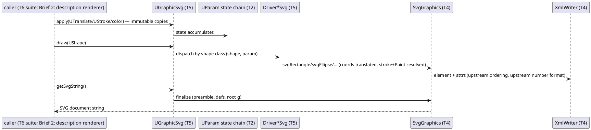
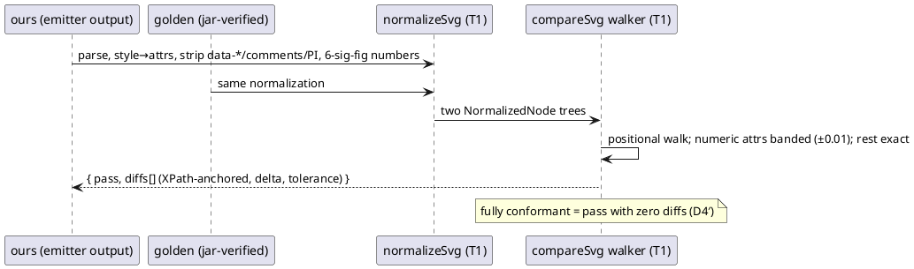

# Data flow — draw → serialize → compare

## Emitter path (what T2–T5 build)

```plantuml
@startuml
participant "caller (T6 suite; Brief 2: description renderer)" as R
participant "UGraphicSvg (T5)" as UG
participant "UParam state chain (T2)" as P
participant "Driver*Svg (T5)" as D
participant "SvgGraphics (T4)" as SG
participant "XmlWriter (T4)" as XW
R -> UG : apply(UTranslate/UStroke/color) — immutable copies
UG -> P : state accumulates
R -> UG : draw(UShape)
UG -> D : dispatch by shape class (shape, param)
D -> SG : svgRectangle/svgEllipse/… (coords translated, stroke+Paint resolved)
SG -> XW : element + attrs (upstream ordering, upstream number format)
R -> UG : getSvgString()
UG -> SG : finalize (preamble, defs, root g)
SG --> R : SVG document string
@enduml
```

## Conformance check (T1 + T6; Brief 2 reuses on fixtures)

```plantuml
@startuml
participant "ours (emitter output)" as O
participant "golden (jar-verified)" as G
participant "normalizeSvg (T1)" as N
participant "compareSvg walker (T1)" as C
O -> N : parse, style→attrs, strip data-*/comments/PI, 6-sig-fig numbers
G -> N : same normalization
N -> C : two NormalizedNode trees
C -> C : positional walk; numeric attrs banded (±0.01); rest exact
C --> O : { pass, diffs[] (XPath-anchored, delta, tolerance) }
note over C : fully conformant = pass with zero diffs (D4′)
@enduml
```
