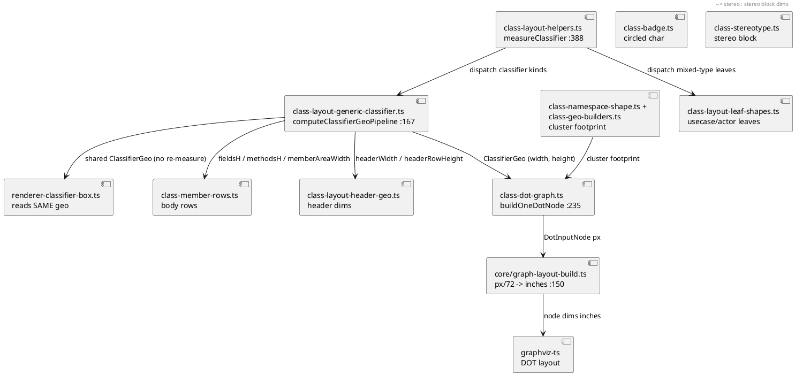

# Component map — class sizing pipeline (files touched by A2s)

Oracle side (spec, read-only): `EntityImageClass.calculateDimensionSlow` →
`EntityImageClassHeader`/`HeaderLayout` + `MethodsOrFieldsArea` → SvekNode
`width=`/`height=` in svek DOT. See README "Key code map" for file:line.
