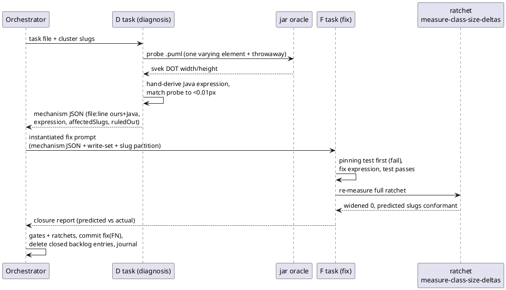

# Data flow — one D→F round

```plantuml
@startuml
participant Orchestrator as O
participant "D task (diagnosis)" as D
participant "jar oracle" as J
participant "F task (fix)" as F
participant "ratchet\nmeasure-class-size-deltas" as R

O -> D : task file + cluster slugs
D -> J : probe .puml (one varying element + throwaway)
J --> D : svek DOT width/height
D -> D : hand-derive Java expression,\nmatch probe to <0.01px
D --> O : mechanism JSON (file:line ours+Java,\nexpression, affectedSlugs, ruledOut)
O -> F : instantiated fix prompt\n(mechanism JSON + write-set + slug partition)
F -> F : pinning test first (fail),\nfix expression, test passes
F -> R : re-measure full ratchet
R --> F : widened 0, predicted slugs conformant
F --> O : closure report (predicted vs actual)
O -> O : gates + ratchets, commit fix(FN),\ndelete closed backlog entries, journal
@enduml
```
