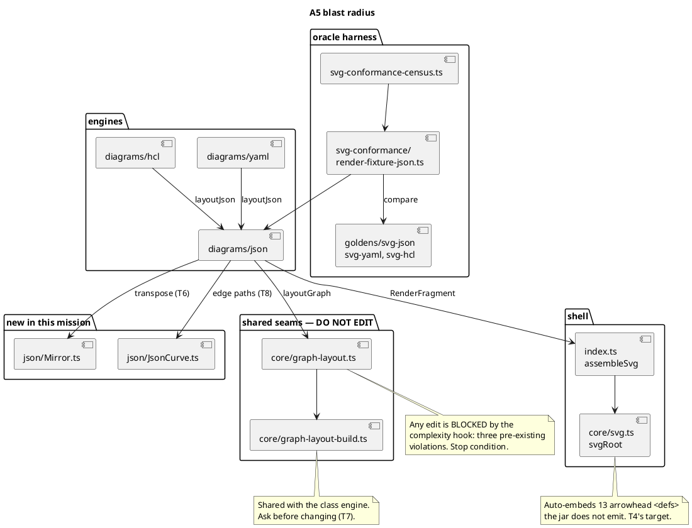

# Component map — what A5 touches

Written and read-only components, and the two seams the mission must not edit.

## Ownership by batch

| Component | Batch | Task |
|---|---|---|
| `tests/oracle/svg-conformance/render-fixture-json.ts` | 1 | T1 |
| `oracle/goldens/svg-{json,yaml,hcl}/` | 1, then appended | T1, T4, T8 |
| `test-results/dot-cache/{json,yaml,hcl}/` | 1 | T2 |
| `src/diagrams/json/renderer.ts` | 2, 3 | T4, T8 |
| `src/index.ts` (shell dispatch only) | 2 | T4 |
| `src/diagrams/json/Mirror.ts` | 3 | T6 |
| `src/diagrams/json/layout.ts` | 3 | T6, T7 |
| `src/diagrams/json/json-layout-prep.ts` | 3 | T7 |
| `src/diagrams/json/JsonCurve.ts` | 3 | T8 |
| `DIVERGENCES.md`, `planning/mission-index.md` | 4 | T10 |

**One writer per file per batch.** `layout.ts` is written by T6 and T7, which is
why Batch 3 is strictly sequential rather than parallel.
