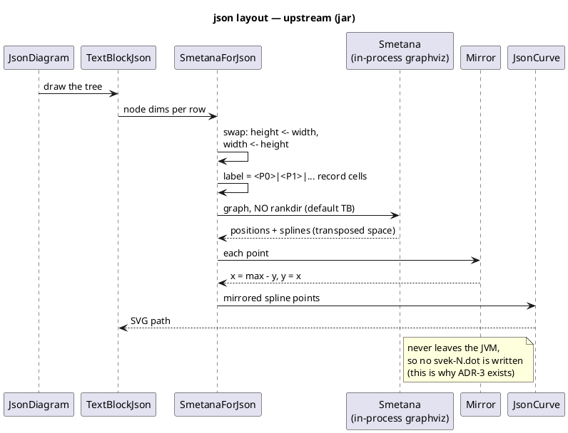
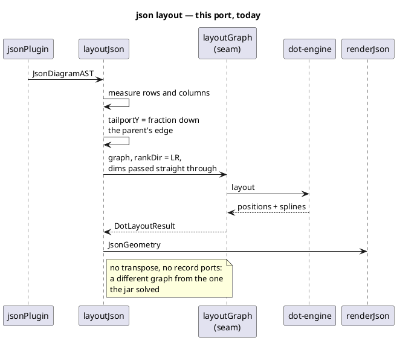
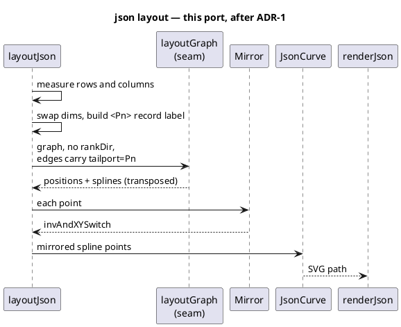
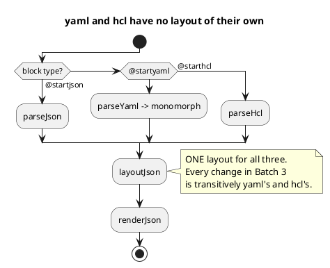

# Data flow — the json layout pipeline, both ways

## Today (this port) vs. upstream

The divergence ADR-1 addresses is visible as soon as the two are drawn side by
side: upstream solves a **transposed** graph and rotates the answer; this port
asks the engine for the final orientation directly.

## After Batch 3

## Where the three types converge

