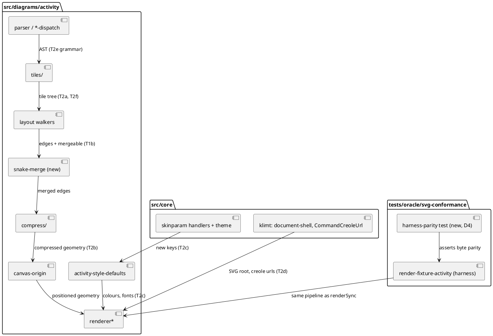

# Component map: what add2 touches

```plantuml
@startuml
package "src/diagrams/activity" {
  component "parser / *-dispatch" as parse
  component "tiles/" as tiles
  component "layout walkers" as walk
  component "snake-merge (new)" as snake
  component "compress/" as comp
  component "canvas-origin" as origin
  component "renderer*" as render
  component "activity-style-defaults" as style
}
package "src/core" {
  component "skinparam handlers + theme" as theme
  component "klimt: document-shell, CommandCreoleUrl" as klimt
}
package "tests/oracle/svg-conformance" {
  component "render-fixture-activity (harness)" as harness
  component "harness-parity test (new, D4)" as parity
}
parse --> tiles : AST (T2e grammar)
tiles --> walk : tile tree (T2a, T2f)
walk --> snake : edges + mergeable (T1b)
snake --> comp : merged edges
comp --> origin : compressed geometry (T2b)
origin --> render : positioned geometry
style --> render : colours, fonts (T2c)
theme --> style : new keys (T2c)
klimt --> render : SVG root, creole urls (T2d)
harness --> render : same pipeline as renderSync
parity --> harness : asserts byte parity
@enduml
```
