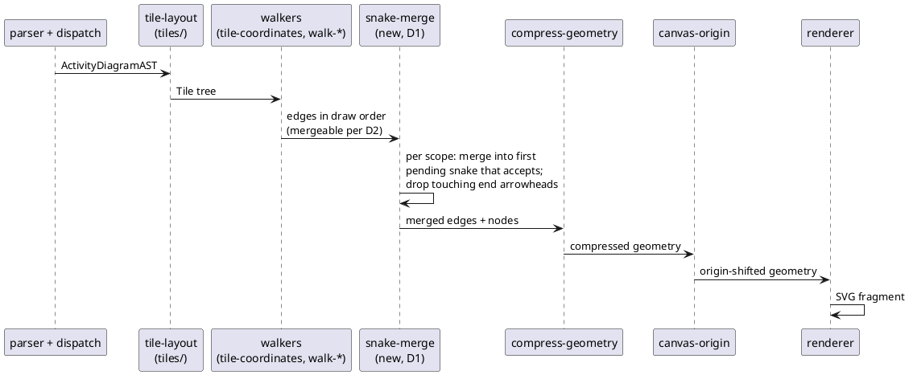

# Data flow: where the snake merge runs (D1)

The merge is a pure pass between the walkers and compression, mirroring
`UGraphicForSnake` sitting between `Swimlanes.drawU` and the compressing
`UGraphic` in the jar.

