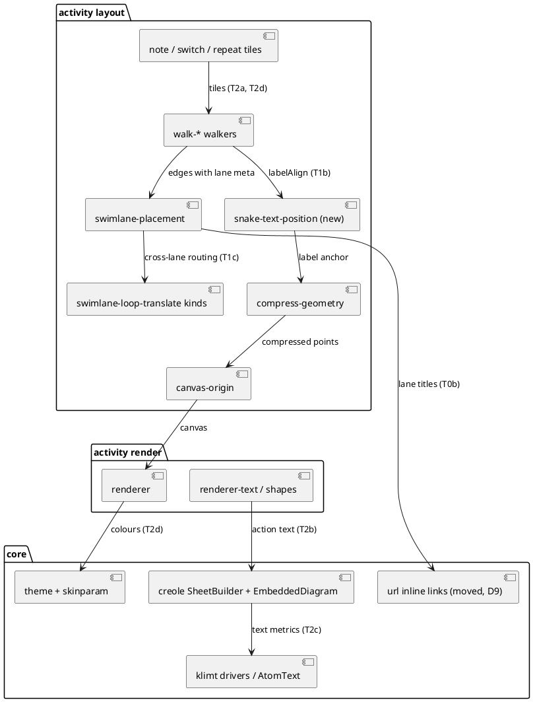

# Component map: what add3 touches

```plantuml
@startuml
package "activity layout" {
  [walk-* walkers] as W
  [swimlane-placement] as S
  [swimlane-loop-translate kinds] as L
  [snake-text-position (new)] as T
  [compress-geometry] as C
  [canvas-origin] as O
  [note / switch / repeat tiles] as N
}
package "activity render" {
  [renderer] as R
  [renderer-text / shapes] as RT
}
package "core" {
  [creole SheetBuilder + EmbeddedDiagram] as SB
  [klimt drivers / AtomText] as K
  [theme + skinparam] as TH
  [url inline links (moved, D9)] as U
}
W --> S : edges with lane meta
S --> L : cross-lane routing (T1c)
W --> T : labelAlign (T1b)
T --> C : label anchor
C --> O : compressed points
O --> R : canvas
RT --> SB : action text (T2b)
SB --> K : text metrics (T2c)
R --> TH : colours (T2d)
S --> U : lane titles (T0b)
N --> W : tiles (T2a, T2d)
@enduml
```
