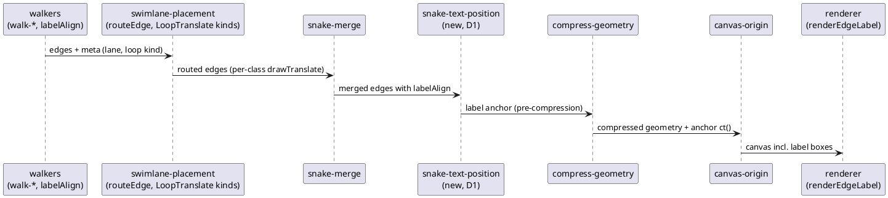

# Data flow: where add3's two lead mechanisms run

Edge labels (D1) and cross-lane routing (D2) both sit between the walkers and
the renderer; the label anchor is computed on pre-compression points and
carried through compression, like add2's emphasize anchor.

