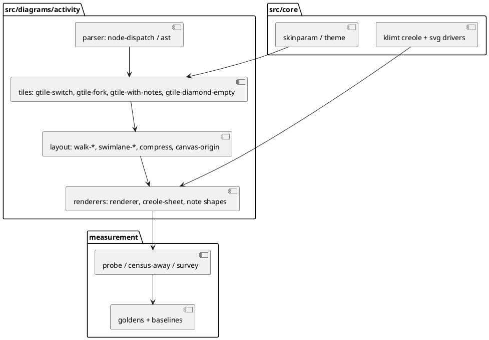

# Component map: activity files add4 touches

```plantuml
@startuml
package "src/diagrams/activity" {
  [parser: node-dispatch / ast] as P
  [tiles: gtile-switch, gtile-fork, gtile-with-notes, gtile-diamond-empty] as T
  [layout: walk-*, swimlane-*, compress, canvas-origin] as L
  [renderers: renderer, creole-sheet, note shapes] as R
}
package "src/core" {
  [skinparam / theme] as S
  [klimt creole + svg drivers] as K
}
package "measurement" {
  [probe / census-away / survey] as M
  [goldens + baselines] as G
}
P --> T
T --> L
L --> R
S --> T
K --> R
R --> M
M --> G
@enduml
```
