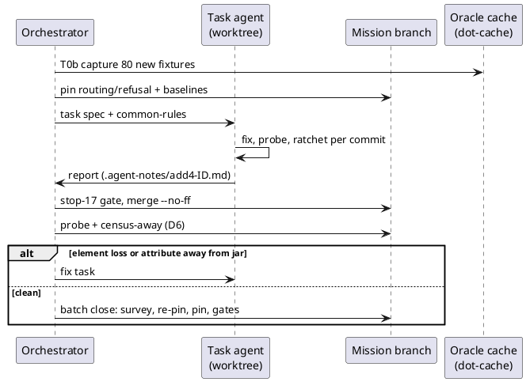

# Data flow: add4 measurement and merge loop

```plantuml
@startuml
participant Orchestrator as O
participant "Task agent\n(worktree)" as A
participant "Mission branch" as B
participant "Oracle cache\n(dot-cache)" as C
O -> C : T0b capture 80 new fixtures
O -> B : pin routing/refusal + baselines
O -> A : task spec + common-rules
A -> A : fix, probe, ratchet per commit
A -> O : report (.agent-notes/add4-ID.md)
O -> B : stop-17 gate, merge --no-ff
O -> B : probe + census-away (D6)
alt element loss or attribute away from jar
  O -> A : fix task
else clean
  O -> B : batch close: survey, re-pin, pin, gates
end
@enduml
```
