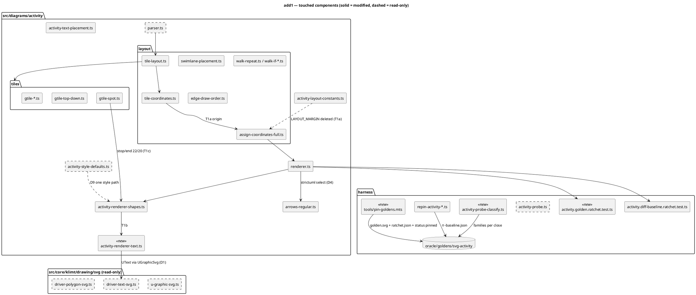

# Component map: what add1 touches

```plantuml
@startuml
title add1 — touched components (solid = modified, dashed = read-only)
skinparam componentStyle rectangle

package "src/diagrams/activity" {
  [parser.ts] #line.dashed
  package "layout" {
    [tile-layout.ts]
    [tile-coordinates.ts]
    [assign-coordinates-full.ts]
    [swimlane-placement.ts]
    [walk-repeat.ts / walk-if-*.ts]
    [edge-draw-order.ts]
  }
  package "tiles" {
    [gtile-spot.ts]
    [gtile-top-down.ts]
    [gtile-*.ts]
  }
  [activity-layout-constants.ts]
  [renderer.ts]
  [activity-renderer-shapes.ts]
  [activity-renderer-text.ts] <<new>>
  [activity-text-placement.ts]
  [arrows-regular.ts]
  [activity-style-defaults.ts] #line.dashed
}

package "src/core/klimt/drawing/svg (read-only)" {
  [u-graphic-svg.ts] #line.dashed
  [driver-text-svg.ts] #line.dashed
  [driver-polygon-svg.ts] #line.dashed
}

package "harness" {
  [activity.golden.ratchet.test.ts] <<new>>
  [activity.diff-baseline.ratchet.test.ts]
  [activity-probe.ts] #line.dashed
  [activity-probe-classify.ts] <<new>>
  [repin-activity-*.ts]
  [tools/pin-goldens.mts] <<new>>
  database "oracle/goldens/svg-activity" as GOLD
}

[parser.ts] --> [tile-layout.ts]
[tile-layout.ts] --> [tiles]
[tile-layout.ts] --> [tile-coordinates.ts]
[tile-coordinates.ts] --> [assign-coordinates-full.ts] : T1a origin
[activity-layout-constants.ts] ..> [assign-coordinates-full.ts] : LAYOUT_MARGIN deleted (T1a)
[assign-coordinates-full.ts] --> [renderer.ts]
[renderer.ts] --> [activity-renderer-shapes.ts]
[activity-renderer-shapes.ts] --> [activity-renderer-text.ts] : T1b
[activity-renderer-text.ts] --> [driver-text-svg.ts] : UText via UGraphicSvg (D1)
[renderer.ts] --> [arrows-regular.ts] : strictuml select (D4)
[gtile-spot.ts] --> [activity-renderer-shapes.ts] : stop/end 22/20 (T1c)
[activity-style-defaults.ts] ..> [activity-renderer-shapes.ts] : D9 one style path
[renderer.ts] --> [activity.golden.ratchet.test.ts]
[renderer.ts] --> [activity.diff-baseline.ratchet.test.ts]
[activity-probe-classify.ts] --> GOLD : families per close
[tools/pin-goldens.mts] --> GOLD : golden.svg + ratchet.json + status pinned
[repin-activity-*.ts] --> GOLD : *-baseline.json
@enduml
```
