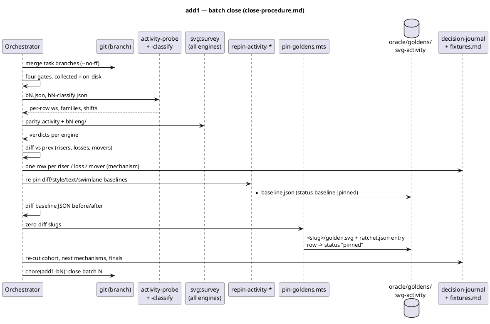
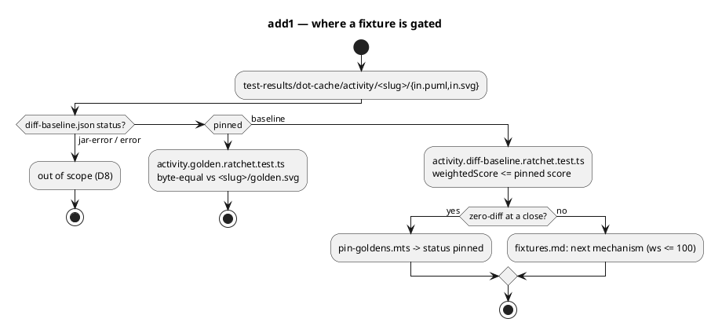

# Data flow: a batch close

```plantuml
@startuml
title add1 — batch close (close-procedure.md)
participant Orchestrator as O
participant "git (branch)" as G
participant "activity-probe\n+ -classify" as P
participant "svg:survey\n(all engines)" as S
participant "repin-activity-*" as R
participant "pin-goldens.mts" as PIN
database "oracle/goldens/\nsvg-activity" as GOLD
participant "decision-journal\n+ fixtures.md" as J

O -> G : merge task branches (--no-ff)
O -> O : four gates, collected = on-disk
O -> P : bN.json, bN-classify.json
P --> O : per-row ws, families, shifts
O -> S : parity-activity + bN-eng/
S --> O : verdicts per engine
O -> O : diff vs prev (risers, losses, movers)
O -> J : one row per riser / loss / mover (mechanism)
O -> R : re-pin diff/style/text/swimlane baselines
R --> GOLD : *-baseline.json (status baseline|pinned)
O -> O : diff baseline JSON before/after
O -> PIN : zero-diff slugs
PIN -> GOLD : <slug>/golden.svg + ratchet.json entry\nrow -> status "pinned"
O -> J : re-cut cohort, next mechanisms, finals
O -> G : chore(add1-bN): close batch N
@enduml
```

# Data flow: one fixture through the gates

```plantuml
@startuml
title add1 — where a fixture is gated
start
:test-results/dot-cache/activity/<slug>/{in.puml,in.svg};
if (diff-baseline.json status?) then (jar-error / error)
  :out of scope (D8);
  stop
elseif (pinned) then
  :activity.golden.ratchet.test.ts\nbyte-equal vs <slug>/golden.svg;
  stop
else (baseline)
  :activity.diff-baseline.ratchet.test.ts\nweightedScore <= pinned score;
  if (zero-diff at a close?) then (yes)
    :pin-goldens.mts -> status pinned;
  else (no)
    :fixtures.md: next mechanism (ws <= 100);
  endif
  stop
endif
@enduml
```
