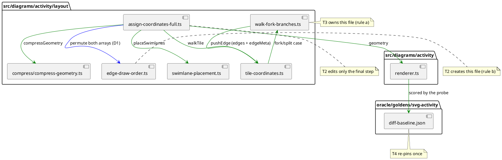

# Write-set map

What each task owns. `edge-draw-order.ts` is new (T2); everything else exists.
Nothing outside `src/diagrams/activity/layout/` changes.

Read-only for every task: `renderer.ts`, `swimlane-placement.ts` (its
`EdgeMeta` type only), `compress/shapes-of.ts`. Out of scope entirely:
`layout.old.ts`, `activity-layout-*.ts`, `src/core/**`, lane widths, and any
node position.
