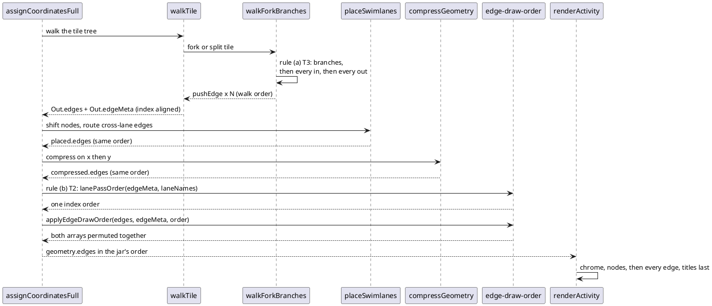

# Where an edge's draw order is decided

One activity render, from parse to SVG. The order of `Out.edges` is set at
`pushEdge` (walk order) and — after this mission — permuted once at the end
of `assignCoordinatesFull` (D1). `walkForkBranches` is where rule (a) lives;
`applyEdgeDrawOrder` is where rule (b) lives.

The jar reaches the same order differently: connections are Snakes buffered
by `UGraphicForSnake` and flushed after every box
(`svek/UGraphicForSnake.java:137-165`), while the lane passes and the final
`Cross` pass decide which pass draws which connection
(`ftile/Swimlanes.java:318-355`).
