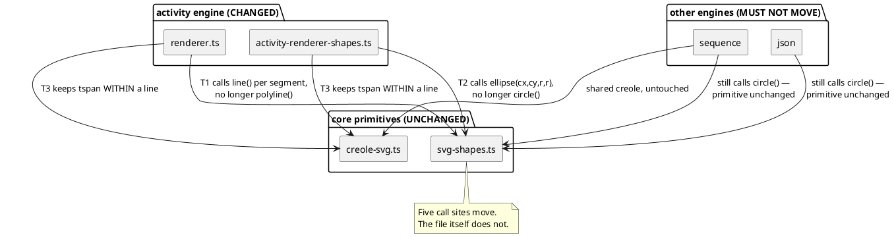

# Component map — what this mission touches

Only the two activity render files change. The shared primitives are called
differently, never modified — that boundary is [D2] and [D3], and it is what
keeps sequence and json from moving.

