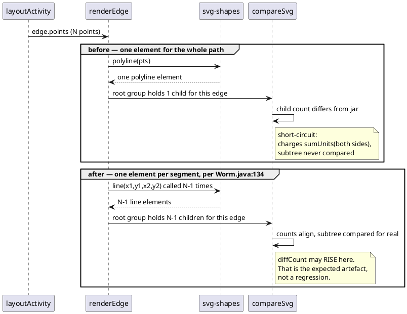

# Data flow — one edge, before and after T1

The child-count deficit in one picture: upstream draws a `ULine` per segment,
we drew a single `polyline` for the whole path. `compareSvg` short-circuits
on the resulting child-count mismatch and charges the whole subtree.

