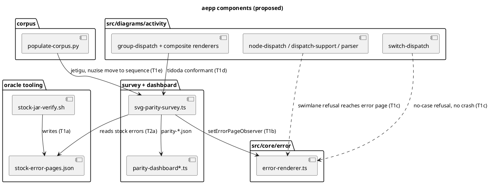

# Component map — what aepp touches (proposed)

```plantuml
@startuml
title aepp components (proposed)
package "oracle tooling" {
  [stock-jar-verify.sh] as V
  [stock-error-pages.json] as R
}
package "src/core/error" {
  [error-renderer.ts] as E
}
package "src/diagrams/activity" {
  [node-dispatch / dispatch-support / parser] as SW
  [switch-dispatch] as SWI
  [group-dispatch + composite renderers] as G
}
package "survey + dashboard" {
  [svg-parity-survey.ts] as S
  [parity-dashboard*.ts] as D
}
package "corpus" {
  [populate-corpus.py] as P
}
V --> R : writes (T1a)
S --> R : reads stock errors (T2a)
S --> E : setErrorPageObserver (T1b)
S --> D : parity-*.json
SW ..> E : swimlane refusal reaches error page (T1c)
SWI ..> E : no-case refusal, no crash (T1c)
G --> S : tidoda conformant (T1d)
P --> S : jetigu, nuzise move to sequence (T1e)
@enduml
```
