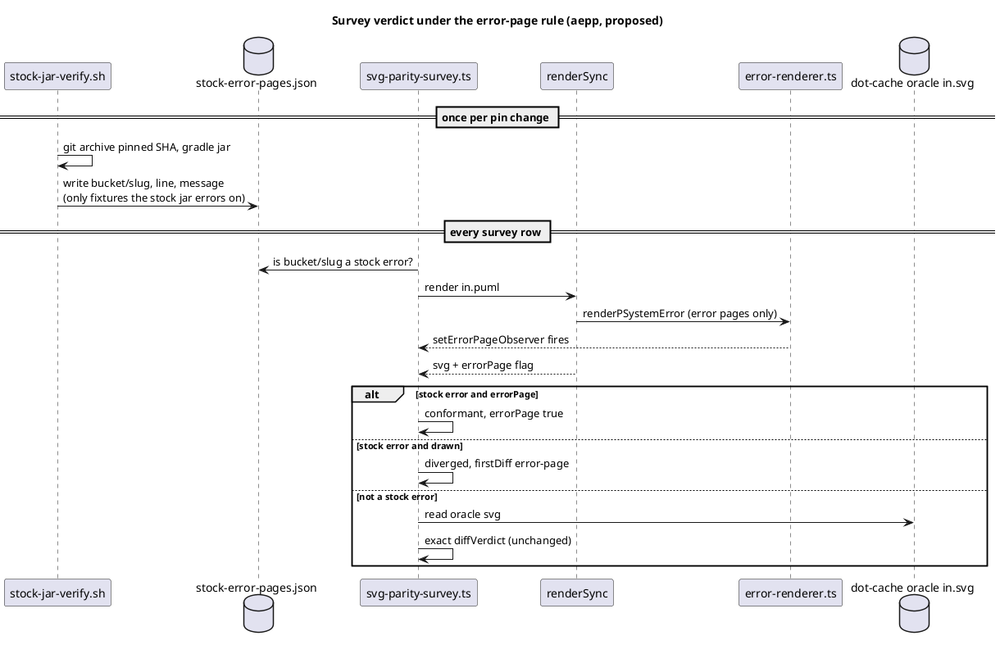

# Data flow — how a fixture gets its verdict (proposed)

```plantuml
@startuml
title Survey verdict under the error-page rule (aepp, proposed)
participant "stock-jar-verify.sh" as V
database "stock-error-pages.json" as R
participant "svg-parity-survey.ts" as S
participant "renderSync" as Ours
participant "error-renderer.ts" as E
database "dot-cache oracle in.svg" as O

== once per pin change ==
V -> V : git archive pinned SHA, gradle jar
V -> R : write bucket/slug, line, message\n(only fixtures the stock jar errors on)

== every survey row ==
S -> R : is bucket/slug a stock error?
S -> Ours : render in.puml
Ours -> E : renderPSystemError (error pages only)
E --> S : setErrorPageObserver fires
Ours --> S : svg + errorPage flag
alt stock error and errorPage
  S -> S : conformant, errorPage true
else stock error and drawn
  S -> S : diverged, firstDiff error-page
else not a stock error
  S -> O : read oracle svg
  S -> S : exact diffVerdict (unchanged)
end
@enduml
```
