# Write-set map

What each task owns. Green = exists; blue = created here; red = deleted.

```plantuml
@startuml
package "src/diagrams/activity/tiles" {
  [gtile-diamond-inside.ts] as GDI #lightblue
  [gtile-if-with-links.ts] as GIWL #lightblue
  [gtile-if-down.ts] as GID #lightblue
  [gtile-if-long-horizontal.ts] as GILH #lightblue
  [gtile-if.ts] as GI #pink
  [gtile-diamond.ts] as GD
}
package "src/diagrams/activity/layout" {
  [conditional-builder.ts] as CB #lightblue
  [tile-layout.ts] as TL
  [tile-coordinates.ts] as TC
  [walk-if-with-links.ts] as WWL #lightblue
  [walk-if-down.ts] as WD #lightblue
  [walk-if-long-horizontal.ts] as WLH #lightblue
  [hexagon-reservations.ts] as HR
  [swimlane-placement.ts] as SP
  [compress/shapes-of.ts] as SO
}
package "src/diagrams/activity" {
  [activity-layout-types.ts] as TY
  [renderer.ts] as R
  [activity-renderer-shapes.ts] as RS
}
package "oracle/goldens/svg-activity" {
  [*-baseline.json] as PINS
}

TL -> CB : buildIf (T3)
CB -> GIWL : with-links (T3)
CB -> GID : down (T4)
CB -> GILH : long-horizontal (T5)
CB ..> GI : legacy until T5
GIWL -> GDI : hexagon + labels
GID -> GDI
GILH -> GDI
TC -> WWL : gtile-if-with-links case (T3)
TC -> WD : gtile-if-down case (T4)
TC -> WLH : gtile-if-long-horizontal case (T5)
WD -> HR : Else reservation (T4)
TC -> TC : sibling link after both endpoints (T6)
WWL -> SP : EdgeShape tags (T3)
R -> TY : arrowhead, emphasize (T2)
RS -> RS : if-merge, if-label (T2)
SO -> SO : if-merge, if-label boxes (T2)
R -> PINS : re-pinned once (T7)

note right of GD : untouched (D2, stop 13)
note bottom of TC : T3–T5 add one case each;\nT2 touches only the repeat case
@enduml
```

Read-only for every task: `edge-draw-order.ts`, `assign-coordinates-full.ts`,
`swimlane-lanes.ts`, `routing/*` (switch keeps
`GConnectionSideThenVerticalThenSide`), `gtile-switch.ts`.
