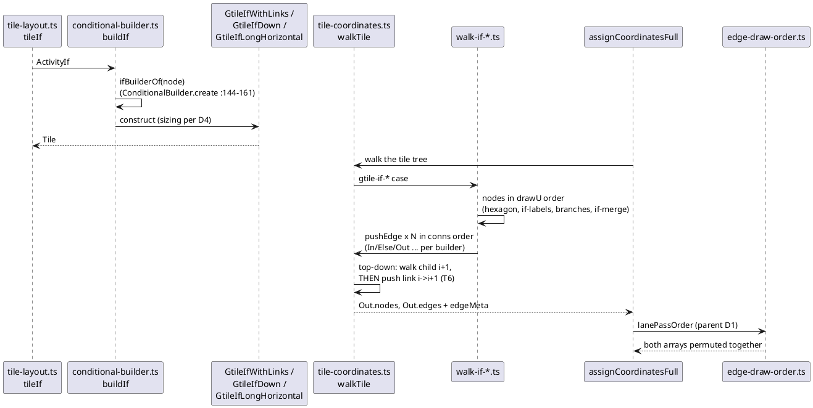

# One `if` from AST to edge run

After this mission. `conditional-builder.ts` (T3) picks the tile class the
way `FtileFactoryDelegatorIf` + `ConditionalBuilder` do; each `walk-if-*`
module (T3–T5) emits nodes in `drawU` order, then connectors in `conns`
order; `gtile-top-down` (T6) pushes the sibling link after both endpoints;
`edge-draw-order.ts` (parent mission) still permutes by lane pass last.

