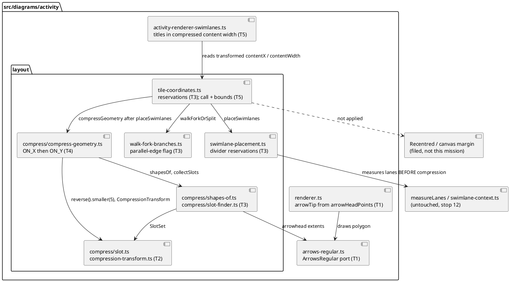

# Component map — write-sets

Which modules each task touches and what each consumes. `Recentred`, lane
width measurement and the parser stay outside the mission.

```plantuml
@startuml
package "src/diagrams/activity" {
  component [arrows-regular.ts\nArrowsRegular port (T1)] as arrows
  component [renderer.ts\narrowTip from arrowHeadPoints (T1)] as renderer
  component [activity-renderer-swimlanes.ts\ntitles in compressed content width (T5)] as rsw
  package "layout" {
    component [compress/slot.ts\ncompression-transform.ts (T2)] as slot
    component [compress/shapes-of.ts\ncompress/slot-finder.ts (T3)] as finder
    component [compress/compress-geometry.ts\nON_X then ON_Y (T4)] as cg
    component [tile-coordinates.ts\nreservations (T3); call + bounds (T5)] as tc
    component [walk-fork-branches.ts\nparallel-edge flag (T3)] as wfb
    component [swimlane-placement.ts\ndivider reservations (T3)] as sp
  }
}
component [Recentred / canvas margin\n(filed, not this mission)] as rec
component [measureLanes / swimlane-context.ts\n(untouched, stop 12)] as ml

renderer --> arrows : draws polygon
finder --> arrows : arrowhead extents
finder --> slot : SlotSet
cg --> finder : shapesOf, collectSlots
cg --> slot : reverse().smaller(5), CompressionTransform
tc --> cg : compressGeometry after placeSwimlanes
tc --> sp : placeSwimlanes
tc --> wfb : walkForkOrSplit
rsw --> tc : reads transformed contentX / contentWidth
sp --> ml : measures lanes BEFORE compression
tc ..> rec : not applied
@enduml
```
