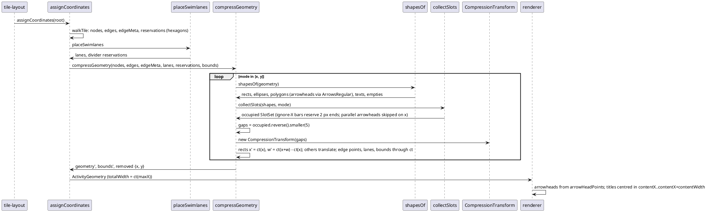

# Data flow — the compress pass after this mission

Who calls whom, in order, for one render. The pass (T4) sits where
`ActivityDiagram3#getTextBlock` wraps the swimlanes block: after layout,
before draw; X first, then Y on the result.

