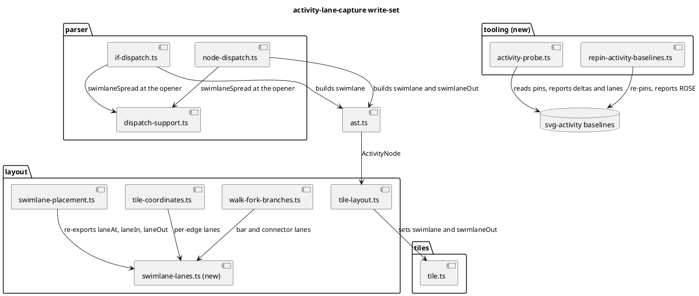

# Component map — the write-set

Component, because the question is which modules change and how they relate.

```plantuml
@startuml
title activity-lane-capture write-set
package "parser" {
  [dispatch-support.ts] as DS
  [if-dispatch.ts] as ID
  [node-dispatch.ts] as ND
}
[ast.ts] as AST
package "tiles" {
  [tile.ts] as T
}
package "layout" {
  [tile-layout.ts] as TL
  [swimlane-lanes.ts (new)] as SL
  [swimlane-placement.ts] as SP
  [walk-fork-branches.ts] as WF
  [tile-coordinates.ts] as TC
}
package "tooling (new)" {
  [activity-probe.ts] as PR
  [repin-activity-baselines.ts] as RP
}
database "svg-activity baselines" as BL

ID --> DS : swimlaneSpread at the opener
ND --> DS : swimlaneSpread at the opener
ND --> AST : builds swimlane and swimlaneOut
ID --> AST : builds swimlane
AST --> TL : ActivityNode
TL --> T : sets swimlane and swimlaneOut
SP --> SL : re-exports laneAt, laneIn, laneOut
WF --> SL : bar and connector lanes
TC --> SL : per-edge lanes
PR --> BL : reads pins, reports deltas and lanes
RP --> BL : re-pins, reports ROSE
@enduml
```
