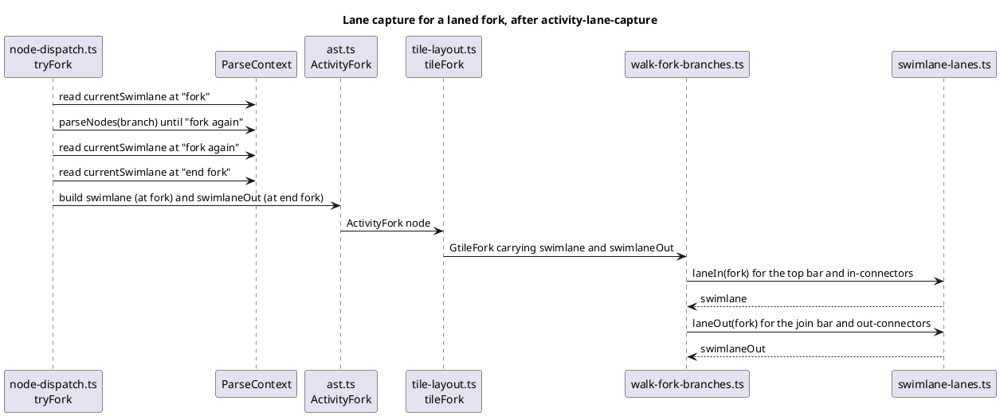

# Data flow — where a fork's lanes are read (after the mission)

Sequence, because the question is who reads the current lane, and when. The
same shape holds for split (Out read at `end split`) and repeat (Out read at
`repeat while`); `if` and `while` read only the opener lane.

