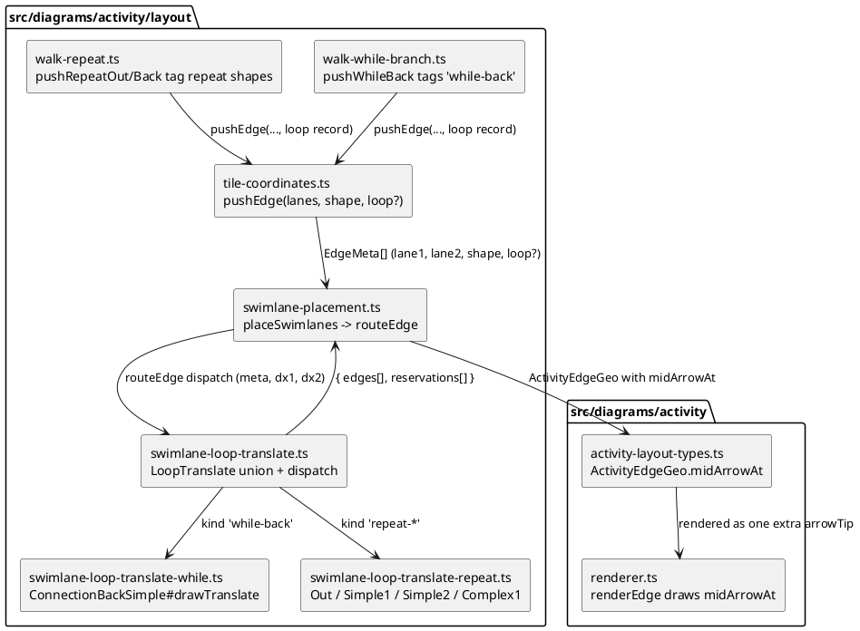

# Component map — what this mission touches

Untouched but read: `swimlane-lanes.ts` (`laneIn`/`laneOut`),
`swimlane-context.ts` (lane origins), `hexagon-reservations.ts`
(`Reservation`), `tiles/gtile-while.ts`, `tiles/gtile-repeat.ts`.
