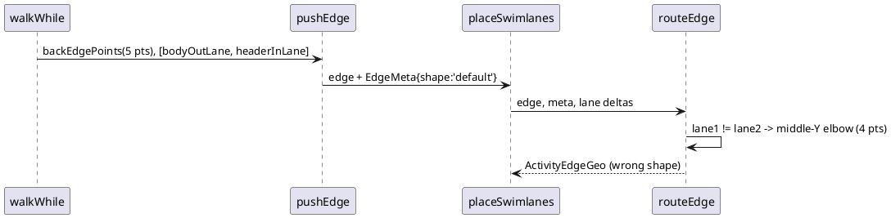
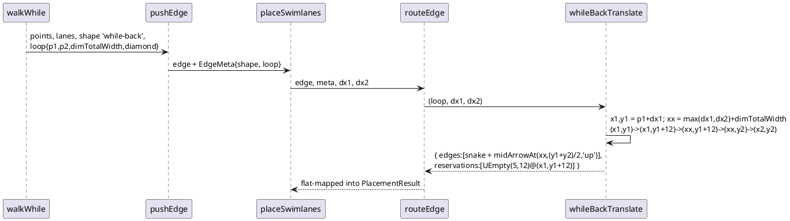

# Data flow — a cross-lane while back edge, before and after

Before (main): the walker pushes the five-point `drawU` shape and
`routeEdge` replaces it with the generic four-point elbow whenever the two
lanes differ.

After (this mission): the walker tags the edge with the tile-local
quantities `ConnectionBackSimple#drawTranslate` reads; placement supplies
the two lane translates and produces the jar's snake, its separate up-arrow
and its reservation.

Java: `vcompact/FtileWhile.java:277-308`; dispatch `ftile/ConnectionCross.java:47-63`.
