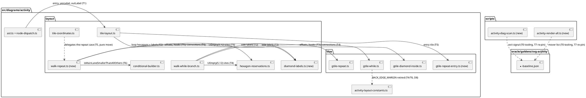

# Write-set map

```plantuml
@startuml
package "src/diagrams/activity" {
  [ast.ts + node-dispatch.ts] as AST
  package "tiles" {
    [gtile-diamond-inside.ts] as GDI
    [gtile-repeat-entry.ts (new)] as GRE
    [gtile-while.ts] as GW
    [gtile-repeat.ts] as GR
  }
  package "layout" {
    [tile-layout.ts] as TL
    [diamond-labels.ts (new)] as DL
    [walk-while-branch.ts] as WW
    [walk-repeat.ts (new)] as WR
    [tile-coordinates.ts] as TC
    [hexagon-reservations.ts] as HR
    [conditional-builder.ts] as CB
  }
  [activity-layout-constants.ts] as K
}
package "scripts" {
  [activity-diag-scan.ts (new)] as SCAN
  [activity-render-all.ts (new)] as RA
}
package "oracle/goldens/svg-activity" {
  [*-baseline.json] as PINS
}
AST -> TL : entry, yesLabel, outLabel (T1)
TL -> GDI : loop hexagons + labels (T2)
TL -> GRE : entry tile (T5)
WW -> DL : side labels (T2)
WR -> DL : side labels (T2)
WW -> GW : offsets, hooks (T3); connections (T4)
WR -> GR : offsets, hooks (T5); connections (T6)
TC ..> WR : delegates the repeat case (T5, pure move)
WR -> CB : isMainLaneSmallerThanAllOthers (T6)
WW -> HR : UEmpty(5,12) sites (T4)
WR -> HR : UEmpty(5,12) sites (T6)
GW ..> K : BACK_EDGE_MARGIN retired (T4/T6, D8)
SCAN ..> PINS : exit signal (T0 tooling, T7 re-pin)
RA ..> PINS : mover list (T0 tooling, T7 re-pin)
@enduml
```
