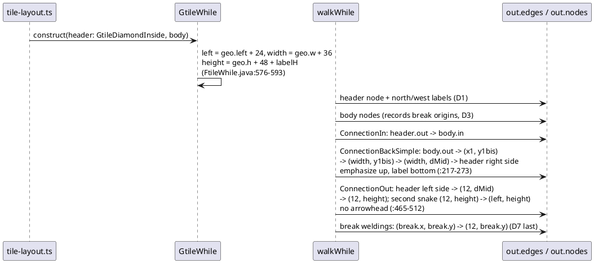
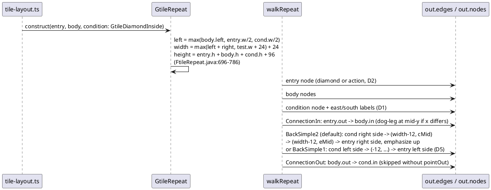

# The jar's loop connections, as the walkers will emit them

```plantuml
@startuml
participant "tile-layout.ts" as TL
participant "GtileWhile" as W
participant "walkWhile" as WW
participant "out.edges / out.nodes" as OUT

TL -> W : construct(header: GtileDiamondInside, body)
W -> W : left = geo.left + 24, width = geo.w + 36\nheight = geo.h + 48 + labelH\n(FtileWhile.java:576-593)
WW -> OUT : header node + north/west labels (D1)
WW -> OUT : body nodes (records break origins, D3)
WW -> OUT : ConnectionIn: header.out -> body.in
WW -> OUT : ConnectionBackSimple: body.out -> (x1, y1bis)\n-> (width, y1bis) -> (width, dMid) -> header right side\nemphasize up, label bottom (:217-273)
WW -> OUT : ConnectionOut: header left side -> (12, dMid)\n-> (12, height); second snake (12, height) -> (left, height)\nno arrowhead (:465-512)
WW -> OUT : break weldings: (break.x, break.y) -> (12, break.y) (D7 last)
@enduml
```

```plantuml
@startuml
participant "tile-layout.ts" as TL
participant "GtileRepeat" as R
participant "walkRepeat" as WR
participant "out.edges / out.nodes" as OUT

TL -> R : construct(entry, body, condition: GtileDiamondInside)
R -> R : left = max(body.left, entry.w/2, cond.w/2)\nwidth = max(left + right, test.w + 24) + 24\nheight = entry.h + body.h + cond.h + 96\n(FtileRepeat.java:696-786)
WR -> OUT : entry node (diamond or action, D2)
WR -> OUT : body nodes
WR -> OUT : condition node + east/south labels (D1)
WR -> OUT : ConnectionIn: entry.out -> body.in (dog-leg at mid-y if x differs)
WR -> OUT : BackSimple2 (default): cond right side -> (width-12, cMid)\n-> (width-12, eMid) -> entry right side, emphasize up\nor BackSimple1: cond left side -> (-12, ...) -> entry left side (D5)
WR -> OUT : ConnectionOut: body.out -> cond.in (skipped without pointOut)
@enduml
```
