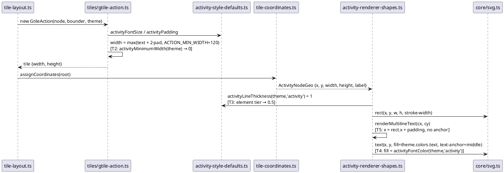

# Where each value is lost today

One activity action box, from AST to SVG, with the four sites this mission
changes. Sequence: who computes what, in order.

```plantuml
@startuml
participant "tile-layout.ts" as TL
participant "tiles/gtile-action.ts" as GA
participant "activity-style-defaults.ts" as SD
participant "tile-coordinates.ts" as TC
participant "activity-renderer-shapes.ts" as RS
participant "core/svg.ts" as SVG

TL -> GA : new GtileAction(node, bounder, theme)
GA -> SD : activityFontSize / activityPadding
GA -> GA : width = max(text + 2·pad, ACTION_MIN_WIDTH=120)\n[T2: activityMinimumWidth(theme) → 0]
GA --> TL : tile {width, height}
TL -> TC : assignCoordinates(root)
TC --> RS : ActivityNodeGeo {x, y, width, height, label}
RS -> SD : activityLineThickness(theme,'activity') = 1\n[T3: element tier → 0.5]
RS -> SVG : rect(x, y, w, h, stroke-width)
RS -> RS : renderMultilineText(cx, cy)\n[T5: x = rect.x + padding, no anchor]
RS -> SVG : text(x, y, fill=theme.colors.text, text-anchor=middle)\n[T4: fill = activityFontColor(theme,'activity')]
@enduml
```
