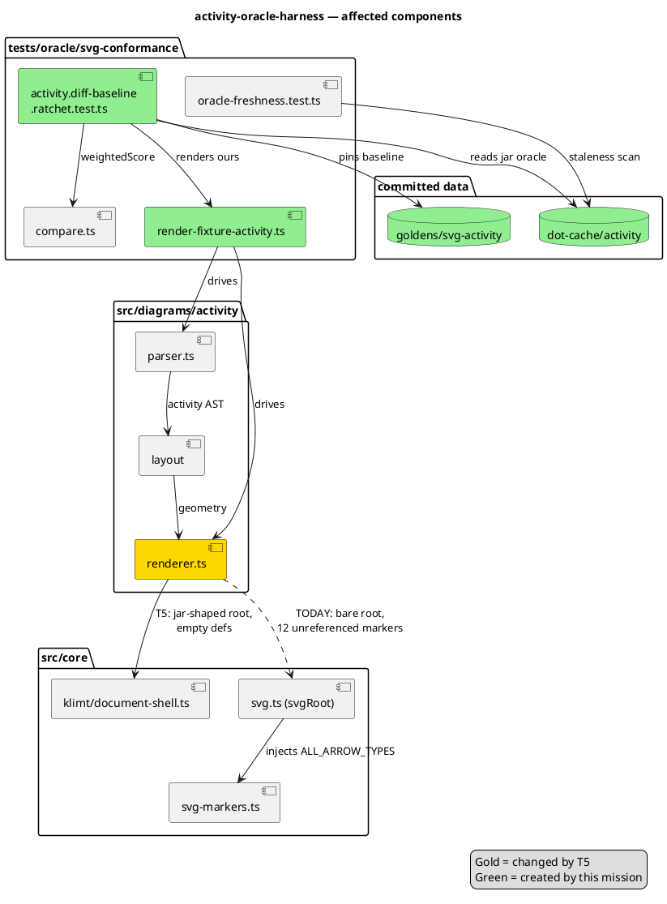

# Component map — what this mission touches

Logical structure: which modules talk to which, and which the mission
changes. `renderActivity` is the only `src/` component that changes.

## Why `svgRoot` is the defect, not the arrowheads

`svgRoot` embeds arrowhead defs automatically for every caller. Activity
draws its arrowheads as inline polygons (`renderer.ts:44`), so all twelve
injected markers are unreferenced — while the jar emits an empty defs
element. Routing through the shell removes the injection; no arrowhead port
is required. This is the whole difference from SI34's sequence equivalent.
